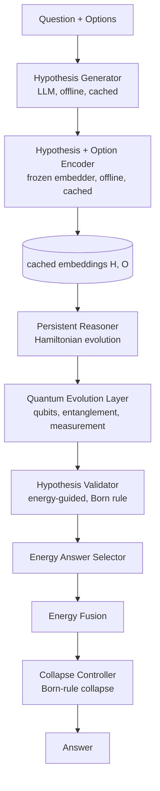
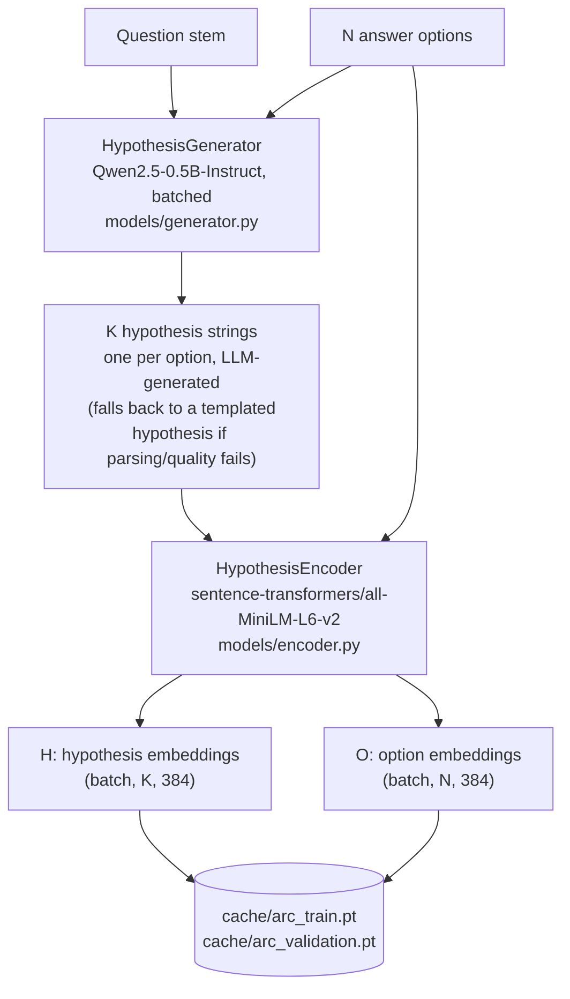
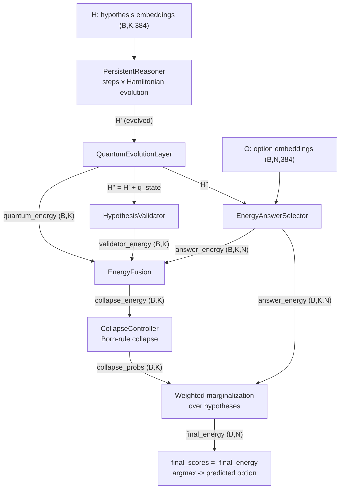
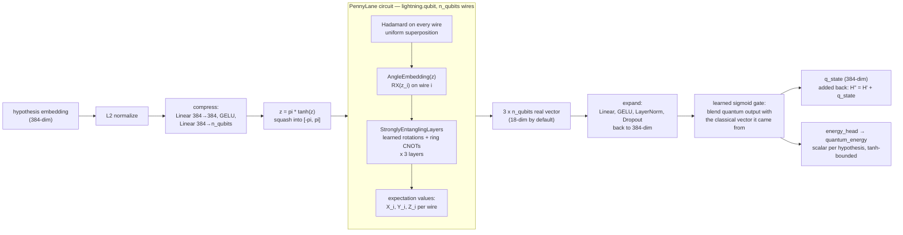
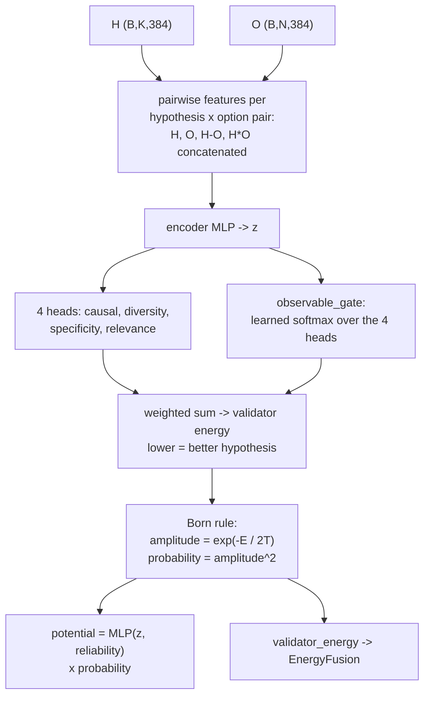
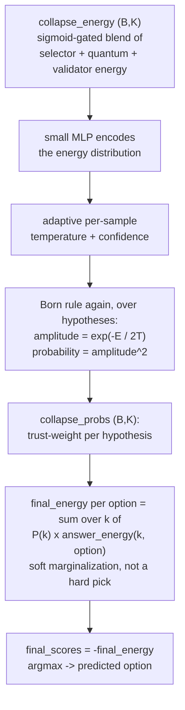
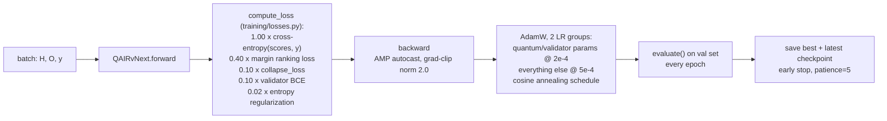

# <div align="center">⚛️ qAIR-vNext</div>

<div align="center">

### Persistent Multi-Hypothesis Quantum-Inspired Reasoning System for Large Language Models


</div>

---

# 🌌 Overview

qAIR-vNext is a research framework that replaces single-path LLM reasoning with:

- an LLM that generates one hypothesis per answer option,
- a differentiable quantum-circuit layer that evolves those hypotheses,
- an energy-guided validator that scores them,
- and a Born-rule-style collapse that turns the surviving hypotheses into an answer.

Instead of reasoning through a single sequential trajectory, qAIR-vNext keeps all hypotheses "in play" simultaneously and only combines them at the very end, weighted by how much the model trusts each one.

This README documents what the code actually does, end to end — see [Known Limitations](#-known-limitations) for the places where the implementation doesn't (yet) match the original design intent.

---

# 🧠 Core Idea

Traditional LLM reasoning:

```text
Input → Transformer → Softmax → Single Answer
```

qAIR-vNext reasoning:



---

# ✨ Key Features

<table>
<tr>
<td width="50%">

## ⚡ Persistent Reasoning

Hypotheses are refined over multiple internal steps (`persistent_steps`) via a learned Hamiltonian-style field before anything else touches them.

</td>
<td width="50%">

## 🌀 Quantum-Inspired Evolution

Each hypothesis is compressed into rotation angles, run through a parameterized quantum circuit (superposition + entanglement), and measured back into a classical vector.

</td>
</tr>

<tr>
<td width="50%">

## 🔥 Energy-Based Reasoning

Every stage (selector, quantum layer, validator) emits an *energy* rather than a probability; lower energy = better. These are fused before the final collapse.

</td>
<td width="50%">

## 🧩 Hypothesis Validation

A learned validator scores each hypothesis on causal quality, diversity, specificity, and relevance, and turns those scores into a Born-rule probability distribution.

</td>
</tr>

<tr>
<td width="50%">

## 📊 Visualization Engine

Manual plotting utilities for energy landscapes, attention/interaction maps, collapse spread, and PCA'd reasoning trajectories.

</td>
<td width="50%">

## 🧪 Ablation Framework

A deconfounded grid (`training/ablations.py`) that toggles quantum / validator / persistent-steps one variable at a time.

</td>
</tr>
</table>

---

# 🏗️ System Architecture

## 1. Offline stage — turning a question into embeddings

Generation and encoding happen once per dataset split and are cached to disk (`cache/arc_*.pt`); they are **not** part of the trainable model. Hypotheses are generated in batches of `GEN_BATCH_SIZE` (`models/generator.py`'s `generate_batch`, one padded `model.generate()` call per chunk) rather than one question at a time -- this only speeds up cache building, not per-epoch training, since the cache is built once and reused across every epoch.



Loading a cache built under a different `EMBEDDING_DIM` (e.g. an older run) raises an explicit error instead of silently mixing incompatible embeddings -- `training/dataset.py` checks the cached tensor's last dimension against `config.EMBEDDING_DIM` before using it.

## 2. Online stage — `QAIRvNext.forward(H, O, y)`

This is the trainable part. Every arrow below is a real tensor produced by the current code (`models/full_model.py`), not an aspirational design.



Note the final step is a **soft** marginalization: the model doesn't pick one hypothesis and discard the rest, it computes a weighted average of every hypothesis's opinion, weighted by `collapse_probs`. Superposition survives all the way to the answer.

---

# 🔬 How Hypotheses Become Qubits

This is the part of `models/quantum_layer.py` that actually touches PennyLane. `n_qubits` defaults to 6 (down from 12 in earlier versions -- see the note below); the circuit runs on the `lightning.qubit` simulator (exact statevector, no shot noise).



**What's genuinely "quantum" here:** the Hadamards put every wire into superposition before any data is loaded; `AngleEmbedding` encodes each hypothesis's learned features as qubit rotation angles; `StronglyEntanglingLayers` couples the qubits together (a classical MLP can't do this — entanglement means the joint state isn't separable into independent per-qubit factors); the Pauli expectation values are the quantum-mechanical observables of that entangled state. **What it is not:** this runs on a classical statevector simulator with autograd through it, so it's exact and noiseless — there's no sampling, no hardware, and no claimed computational advantage (see [Research Disclaimer](#️-research-disclaimer)). The circuit's outputs are just another differentiable feature transform from the training's point of view; the "quantum-ness" is in *how* that transform is structured, not in the training loop treating it specially.

**Why 6 qubits, not 12:** the statevector this circuit simulates has `2^n_qubits` entries, and every gate acts on the whole vector -- cost scales roughly `O(n_qubits · 2^n_qubits)` per circuit evaluation, and this runs once per hypothesis, per sample, per batch, per epoch. At `n_qubits=12` this was the dominant per-epoch cost by a wide margin. Dropping to 6 qubits cuts the simulated state from 4096-dim to 64-dim -- a large constant-factor speedup with a much smaller circuit -- while still producing an 18-dim measurement vector, comparable to what similar hybrid quantum-classical "feature map" layers use in the literature.

---

# 🧩 How Validation Works

`models/validator.py`'s job is to score each hypothesis against every answer option and turn those scores into a probability distribution — using the same Born-rule construction (`amplitude = exp(-E/2T)`, `probability = amplitude²`) that the final collapse uses later.



The four heads (`causal`, `diversity`, `specificity`, `relevance`) are explicitly named after physical observables in the code (`observable_gate`) — the model learns how much to weight each one per sample, rather than using fixed weights. When ground-truth labels (`y`) are available, `relevance` also gets a direct BCE supervision signal against the true option index (`training/losses.py`).

`potential` is computed here but, as of this version, isn't consumed anywhere — see [Known Limitations](#-known-limitations).

---

# 🌀 Collapse & Answer Selection

`models/collapse.py` runs the same Born-rule pattern a second time, this time over the *fused* per-hypothesis energy (selector + quantum + validator, blended by `models/energy_fusion.py`'s learned sigmoid gates) rather than over hypothesis-vs-option scores.



"Delayed collapse" in this codebase means: the probability distribution over hypotheses is computed with a *learned, per-sample temperature* (not a fixed annealing schedule), and it's used to *weight* the final answer rather than to hard-select a single hypothesis. `collapse.py` also emits `entropy`, `diversity`, `spread`, and `peak` metrics that feed directly into the training loss below, nudging the collapse distribution toward a target entropy of 0.5 (neither a single dominant hypothesis nor a uniform blur).

---

# 🏋️ Training



- The quantum layer is force-run outside autocast in fp32 (`with autocast(enabled=False)`) — `lightning.qubit`/PennyLane's autograd through the circuit isn't mixed-precision safe, so only that submodule pays the fp32 cost.
- Quantum and validator parameters get a lower learning rate (2e-4) than the rest of the model (5e-4) since they're the newest, least-converged components.
- All of this is centralized in [`config.py`](config.py) — dim, `n_qubits`, `persistent_steps`, LRs, batch size, epochs, patience, and checkpoint/cache directories are defined once and imported everywhere, rather than hardcoded per entry point.
- **Current defaults (v41):** `batch_size=16`, `epochs=30` — both increased from the previous version (`8`, `20`) since cutting `n_qubits` and the embedding dim (see above) freed up per-epoch compute budget. `patience=5` early stopping means the epoch ceiling is a cap, not a commitment.

---

# 📂 Project Structure

```text
qAIR-CSE499B/
│
├── benchmarks/          # dataset loaders (ARC-Challenge + ARC-Easy merged)
├── cache/                # cached hypothesis/option embeddings (built on first run)
├── ckpt/                 # model checkpoints, one set per ablation config
├── evaluation/            # manual inference & sample-question evaluation
├── exports/               # plots/CSVs/reports written by visualization/
├── logs/
├── models/                 # QAIRvNext and its submodules
│   ├── generator.py          # HypothesisGenerator (LLM, offline)
│   ├── encoder.py             # HypothesisEncoder (frozen embedder, offline)
│   ├── persistent_reasoner.py # Hamiltonian-style iterative reasoning
│   ├── quantum_layer.py       # QuantumEvolutionLayer (PennyLane circuit)
│   ├── validator.py           # HypothesisValidator (energy + Born rule)
│   ├── answer_selector.py     # EnergyAnswerSelector
│   ├── energy_fusion.py       # blends selector/quantum/validator energy
│   ├── collapse.py            # CollapseController (Born-rule collapse)
│   └── full_model.py          # QAIRvNext -- wires the above together
├── notebooks/               # Colab notebook(s)
├── training/                  # dataset, losses, trainer, ablation grid
├── visualization/              # manual plotting utilities (not auto-wired)
├── config.py                    # single source of truth for shared hyperparameters
├── main.py                      # CLI entry point: --mode train | ablation
└── requirements.txt
```

---

# 🧬 Benchmarks

| Benchmark               | Status         | Purpose                    |
| ------------------------ | -------------- | --------------------------- |
| ARC-Challenge + ARC-Easy | ✅ Implemented | Grade-school science reasoning (merged for more training data — see `benchmarks/arc.py`) |
| GSM8K                    | 🔲 Planned     | Multi-step math reasoning  |
| CommonsenseQA             | 🔲 Planned     | Commonsense reasoning      |
| StrategyQA                 | 🔲 Planned     | Implicit reasoning         |
| TruthfulQA                  | 🔲 Planned     | Hallucination resistance   |

---

# 🧪 Ablation Framework

The grid in `training/ablations.py` is deconfounded — each row changes exactly one variable relative to its nearest neighbor, so effects can be isolated instead of tangled together.

| Config              | Quantum | Validator | Persistent Steps | Isolates                          |
| -------------------- | :-----: | :-------: | :---------------: | ---------------------------------- |
| `A1_baseline`         | ✗       | ✗         | 3                  | floor -- neither module            |
| `A1b_quantum_only`    | ✓       | ✗         | 3                  | quantum, vs. `A1_baseline`         |
| `A2_validator`         | ✗       | ✓         | 3                  | validator, vs. `A1_baseline`       |
| `A3_persistent`        | ✓       | ✓         | 3                  | quantum + validator together       |
| `A4_full_hybrid`        | ✓       | ✓         | 5                  | `persistent_steps` 3→5, vs. `A3`   |

Every config trains from a fresh random init (warm-starting from a "parent" config's weights was tried and reverted — it saturated `EnergyAnswerSelector`'s clamp and killed gradient flow through the newly-added component).

---

# 🚀 Installation

## Clone Repository

```bash
git clone https://github.com/Thorfast191/qAIR-CSE499B.git
cd qAIR-CSE499B
```

## Install Dependencies

```bash
pip install -r requirements.txt
```

---

# ☁️ Google Colab Setup

The full Colab workflow (mount Drive, clone, install, run the ablation suite, evaluate, generate visualizations) lives in [`notebooks/qair_v41_colab.ipynb`](notebooks/qair_v41_colab.ipynb) — open it directly from GitHub in Colab rather than copying snippets. It uses a fresh `qAIR_V41` Drive folder, separate from any earlier `qAIR_V40` cache/checkpoints (those were built with a different embedding dimension and aren't compatible -- see the cache dim-consistency check noted above).

Minimal version, if you just need the paths:

```python
from google.colab import drive
import os

drive.mount('/content/drive')

BASE = "/content/drive/MyDrive/qAIR_V41"
for p in ["cache", "ckpt", "logs", "exports"]:
    os.makedirs(f"{BASE}/{p}", exist_ok=True)
```

---

# ▶️ Run Training

```bash
python main.py --mode train
```

# ▶️ Run Ablation Suite

```bash
python main.py --mode ablation
```

Both commands use the defaults in `config.py` (cache/checkpoint directories, batch size, epochs, patience, `n_qubits`) unless overridden by calling `run_training()` / `run_ablation_suite()` directly with different arguments.

---

# 📊 Example Research Outputs

## Energy Landscape

```text
Step 0 → broad energy spread
Step 1 → interaction refinement
Step 2 → selective amplification
Step 3 → delayed collapse
```

---

# ⚠️ Known Limitations

Documented honestly so the architecture diagrams above aren't read as claims about behavior that doesn't exist yet:

- **Validator guidance isn't closed-loop.** `HypothesisValidator` computes a `potential` field meant to steer `PersistentReasoner`'s Hamiltonian evolution (`persistent_reasoner.py` already accepts a `potential` argument for this), but `QAIRvNext.forward` calls `self.reasoner(H)` without ever passing it in. The validator currently only affects the final answer through `validator_energy` in `EnergyFusion`, not through the reasoning trajectory itself. Wiring this up is a small, well-contained change if/when it's wanted.
- **The quantum layer is a simulator, not hardware.** `lightning.qubit` runs an exact statevector simulation with autograd through it — no shot noise, no physical qubits, no claimed quantum computational advantage. It's a differentiable circuit-structured feature transform.
- **`visualization/*.py` and `evaluation/sample_inference.py` are manual tools.** They aren't invoked automatically by `main.py` or the training loop; run them yourself from a notebook (see `notebooks/qair_v41_colab.ipynb` for the intended usage).
- **Only ARC is implemented.** The other benchmarks listed above are planned, not wired up.

---

# 🎯 Research Goals

qAIR-vNext explores:

- persistent reasoning systems,
- dynamic hypothesis evolution,
- energy-based reasoning control,
- multi-path reasoning architectures,
- and quantum-inspired latent dynamics.

---

# 🔬 Current Research Status

## Current Focus

- Persistent hypothesis evolution
- Validator-guided reasoning
- Collapse stabilization
- Hypothesis diversity preservation
- Multi-step reasoning dynamics

---

# 📚 Citation

```bibtex
@misc{qairvnext2026,
  title={qAIR-vNext: Persistent Multi-Hypothesis Quantum-Inspired Reasoning for Language Models},
  author={Md Arafat Islam},
  year={2026}
}
```

---

# 👨‍💻 Author

<div align="center">

## Md Arafat Islam

Quantum-Inspired AI Research

</div>

---

# ⚠️ Research Disclaimer

This repository is an active research framework.

The project explores:

- quantum-inspired reasoning dynamics,
- persistent hypothesis systems,
- and energy-based reasoning architectures.

This is NOT a claim of quantum computational advantage. The quantum circuit runs on a classical statevector simulator (`lightning.qubit`) with exact, noiseless expectation values -- it is a differentiable, physically-inspired feature transform, not a demonstration of any advantage physical quantum hardware would provide.

---

# 🌠 Future Directions

- Wire `HypothesisValidator`'s `potential` back into `PersistentReasoner` for genuine closed-loop validator guidance
- Dynamic hypothesis spawning
- Reinforcement-guided collapse
- Long-horizon persistent memory
- Multi-agent reasoning fields
- Energy landscape optimization
- Graph-based reasoning interaction
- Differentiable collapse scheduling
- Expand benchmark coverage to GSM8K, CommonsenseQA, StrategyQA, TruthfulQA
- Shot-based / hardware quantum backend as an optional, explicitly-labeled experiment

---

<div align="center">

# ⚛️ qAIR-vNext

### Persistent Hypothesis-Field Reasoning for the Next Generation of AI

</div>