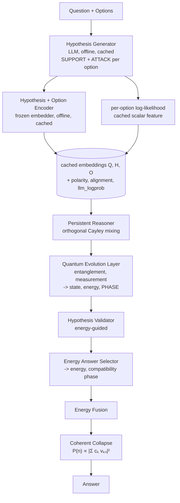
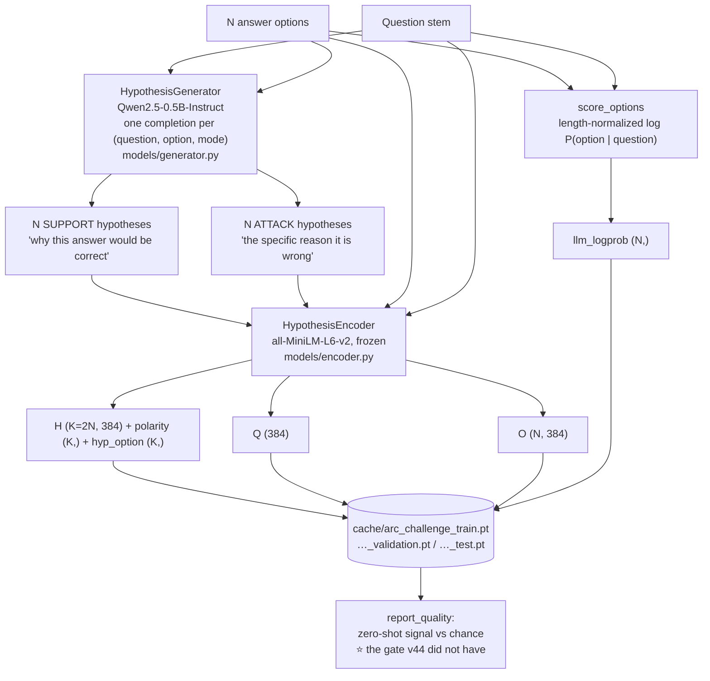
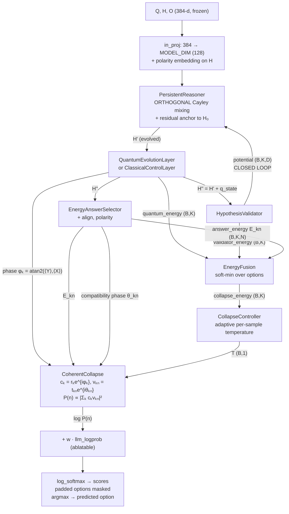
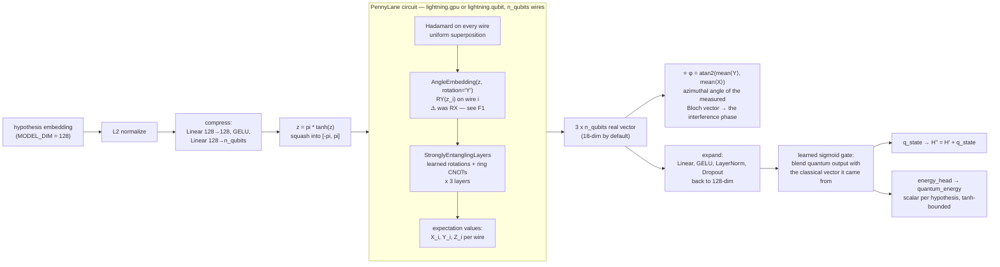
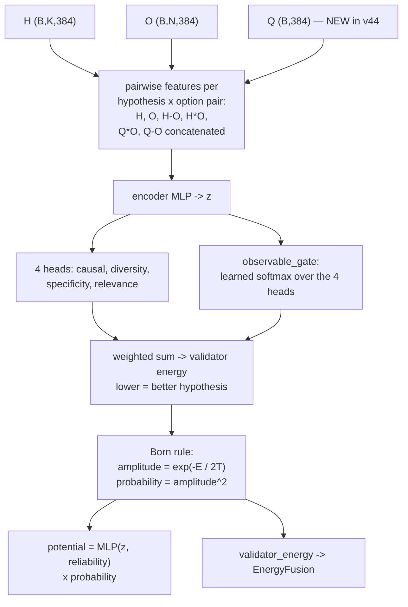
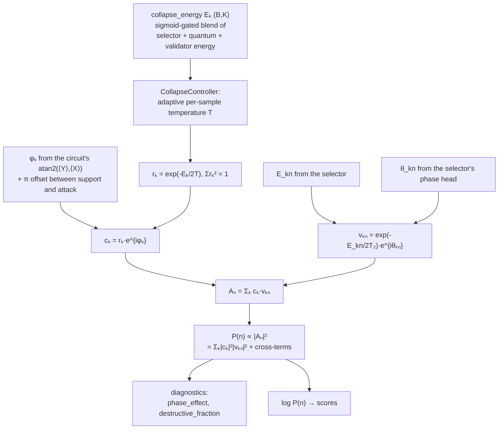
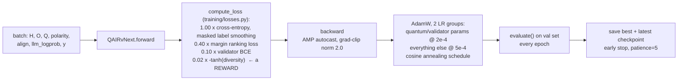

# <div align="center">⚛️ qAIR-vNext</div>

<div align="center">

### Persistent Multi-Hypothesis Quantum-Inspired Reasoning System for Large Language Models


</div>

---

# 🌌 Overview

qAIR-vNext is a research framework that replaces single-path LLM reasoning with:

- an LLM that generates, for each answer option, **both a supporting and an attacking hypothesis**,
- a differentiable quantum-circuit layer that evolves those hypotheses and emits a **phase**,
- an energy-guided validator that scores them,
- and a **complex-amplitude** collapse, `P(n) ∝ |Σₖ cₖ vₖₙ|²`, whose cross-terms let hypotheses cancel.

Instead of reasoning through a single sequential trajectory, qAIR-vNext keeps all hypotheses "in play" simultaneously and only combines them at the very end, weighted — and phased — by how much the model trusts each one.

This README documents what the code actually does, end to end. Benchmark: **ARC-Challenge** (not merged with ARC-Easy — see [Benchmarks](#-benchmarks)).

> **⚠️ v45 is the current release. Start with [what v45 changed](#-v45--what-changed-and-why). Every quantum and ablation number produced before v45 is void, and the [v44 audit](#-v44-audit--what-was-broken-and-what-changed) below explains why.**

---

# 🔭 v45 — What Changed, and Why

An independent audit of v44 reached a harder conclusion than the v44 audit had. The four v44 bugs were real and fixed, but they were not the reason the system did not work. The reason was upstream of all of them:

> **The hypothesis-generation protocol destroyed the discriminative signal by construction, and no downstream architecture could recover it.**

v44 asked the LLM, for each option, to *"state the reasoning that would make this proposed answer correct."* A competent model obliges — **for all four options**. It manufactures symmetric support, and four equally fluent justifications contain no evidence about which option is true. Measured on the clean v44 cache (0% fallbacks, alignment guaranteed by construction, question encoded):

| measurement | value | implication |
|---|---|---|
| `argmax diag(H·O)` | **0.2481** | chance is 0.2500. Hypothesis–option agreement carried **zero** information about correctness |
| mean pairwise `cos(Hₖ, Hⱼ)` | **0.6466** | the hypotheses were **less diverse** than the options (0.4773) they were generated from |
| train loss ↓54% while val acc ↓ | epochs 1→6 | 13,223 parameters per training example — memorizing, not learning |

That single fact explains every downstream observation without invoking any of the four v44 bugs: the selector ignored `H` because `H` was uninformative, the collapse was uniform because there was nothing to discriminate, and accuracy tracked option priors because that was the only signal present.

## The seven changes

| # | v44 | v45 | Where |
|---|---|---|---|
| 1 | one *supporting* hypothesis per option → symmetric, uninformative | **support + attack** per option, `K = 2N`, each with polarity and option alignment | `models/generator.py`, `training/dataset.py` |
| 2 | cache quality = template-fallback rate (read 0% on a useless cache) | cache gated on **measured zero-shot signal**; refuses to look fine when it isn't | `QAIRDataset.report_quality` |
| 3 | Born rule ≡ `softmax(−E/T)` to 5.96e-08 | **complex amplitudes**; `P(n) ∝ \|Σₖ cₖ vₖₙ\|²` with cross-terms that can go **negative** | `models/interference.py` |
| 4 | "interference" used row-softmax weights — a convex combination, so cancellation was arithmetically impossible | **orthogonal (Cayley) mixing**: signed, norm-preserving, invertible | `models/persistent_reasoner.py` |
| 5 | the circuit was 54 of 10.58M params and changed nothing measurable | the circuit's `atan2(⟨Y⟩, ⟨X⟩)` **drives the phase** — the one operation with no classical equivalent | `models/quantum_layer.py` |
| 6 | 10.58M params on 800 examples; best accuracy at **epoch 1**, declining after | `MODEL_DIM=128` → **~1.05M**; the capacity/data confound is removed | `config.py`, `models/full_model.py` |
| 7 | the direct-LLM baseline was never run | the generator's per-option log-likelihood is **cached at build time** — free to report, and usable as an explicit, ablatable log-prior | `models/generator.py::score_options` |

Plus: ARC-Challenge only (merging with ARC-Easy made every number incomparable to published work and confounded every effect with the mixture ratio); `energy * (0.5 + confidence)` self-gating removed; the three selector energies scale-normalized before fusion; label smoothing applied over **valid options only**; ECE reported.

## Every claim ships with its own falsifier

This is the part that matters. v44 reported a plausible 33.7% while three separate mechanisms were provably inert, because nothing measured them. In v45 each claim has a number that fires when it is false:

| claim | metric | inert value | enforced by |
|---|---|---|---|
| the hypotheses carry signal | zero-shot support/attack accuracy vs chance | ≈ 0.25 | `report_quality`, at cache-build time |
| the model uses them | per-channel input ablation | Δ ≈ 0 | `evaluation/input_ablation.py` (exits non-zero) |
| hypotheses stay distinct | `pairwise_cos`, `h_cos` | → 1.0 | `[COLLAPSE WARNING]` above 0.99 |
| the phases do something | `phase_effect` | → 0 | `[INTERFERENCE WARNING]` |
| interference is genuinely non-classical | `destructive_fraction` | → 0 | `[INTERFERENCE WARNING]` |
| the result isn't just the generator | `F0` vs `A3`; `llm_logprob := zeros` ablation | — | ablation grid + input ablation |

`destructive_fraction` is the strict one: it counts `(sample, option)` pairs where the cross-term is **negative**. That is identically zero for any real, non-negative amplitude scheme — including every previous version of this project — so a non-zero value is the single measurement here that a classical mixture cannot reproduce.

## What v45 does *not* claim

- **Not unitary evolution.** Only the hypothesis-*mixing* operator is orthogonal. The per-hypothesis refinement around it is a standard residual FFN and is not norm-preserving. The block as a whole is not unitary and is not described as such.
- **Not quantum advantage.** Whether the simulator backing the circuit is `lightning.qubit` (CPU) or `lightning.gpu` (NVIDIA cuStateVec — see `config.QUANTUM_DEVICE`), it is exact and noiseless: no shot sampling, no physical qubits, no claimed computational advantage over the equivalent classical linear algebra. cuStateVec is a faster simulator, not a quantum computer. See the [Research Disclaimer](#️-research-disclaimer).
- **Not a result.** As of this release the architecture is verified to *execute* and its mechanisms are verified to be *live*. Whether support/attack asymmetry actually exists in Qwen2.5-0.5B's output on ARC-Challenge, and whether the phases help, are open empirical questions that the grid in §[Ablation Framework](#-ablation-framework) is built to answer.

---

# 🔍 v44 Audit — What Was Broken, and What Changed

> *Kept in full as history. These fixes are all still in the code; v45 sits on top of them.*

> **Read this before interpreting any result in this repository.**
> A full technical audit found that the three mechanisms constituting the research contribution — the quantum circuit, multi-hypothesis superposition, and Born-rule collapse — were **all provably inert** in the trained model. Every quantum and ablation result produced before v44 is void. The fixes are described below; the numbers that motivated them are measured, not estimated.

## The four fatal findings

### F1 — The quantum circuit ignored its input entirely

`Hadamard` on every wire prepares \|+⟩<sup>⊗n</sup>, the **+1 eigenstate of Pauli-X**. `AngleEmbedding` defaults to `rotation="X"`, and RX(θ)\|+⟩ = e<sup>−iθ/2</sup>\|+⟩ — a **global phase**, unobservable by any expectation value. The circuit's output was bit-exactly independent of the data:

```
output std across 8 distinct inputs :  0.000e+00      <- dead
same circuit without the Hadamard   :  0.094
```

The 1.12M-parameter "quantum layer" was a learned **constant**. `use_quantum=True` vs `False` measured nothing.

**Fix:** `rotation="Y"` — RY(θ)\|+⟩ tilts the Bloch vector off the equator, so the encoding is observable while the "start in uniform superposition" motif is preserved. Measured input-sensitivity: **0.123** (vs 0.094 for dropping the Hadamard, 0.089 for RZ).

### F2 — The persistent reasoner collapsed to a constant fixed point

After 5 steps, every hypothesis became the *same vector*, and that vector was independent of the input:

```
pairwise cos(H_k, H_j):  0.199 -> 0.814 -> 0.997 -> 0.9999 -> 1.000000
|| reasoner(H) - reasoner(0) ||  =  1.9e-03
```

Cause: `field_k = Σ_j a_kj H_j` with **unnormalized** `tanh` weights, so `field_k ≈ (Σ_j a_kj)·mean_j(H_j)` — the same vector for every k — injected with a large step, five times. Textbook oversmoothing. Two contributing bugs: `dt` and `memory_decay` were stored **post-sigmoid by mistake**, so `nn.Parameter(0.10)` gave an actual step size of `sigmoid(0.10) = 0.525`, 5× the intended value.

**Fix:** row-stochastic (softmax) interaction, a gated residual anchor to the original hypotheses each step, and logit-space `dt`/`decay`. Verified: no collapse even at 20 steps (pairwise cos 0.358), `dt` init now exactly 0.1000.

### F3 — The model's answer was bit-identical under every corruption of H

```
intact H, O                     294/869 = 0.3383
H := zeros                      294/869 = 0.3383
H := gaussian noise             294/869 = 0.3383
H shuffled within sample        294/869 = 0.3383
H from a DIFFERENT question     294/869 = 0.3383
H := O  (pure option echo)      294/869 = 0.3383
O := zeros                      223/869 = 0.2566   <- only O ever mattered
```

The reported 33.7% was an **option-prior classifier** — and it was *beaten by a 30-line MLP on option embeddings alone (35.9%)*. The architecture was net-negative against its own simplest baseline.

**Fix:** this is now a first-class regression test — `evaluation/input_ablation.py`, which exits non-zero if destroying the hypotheses doesn't cost accuracy. Run it after every training run.

### F4 — A third of all hypotheses were template noise, and alignment was broken

| | train | validation |
|---|---|---|
| fallback hypotheses | 4465/13478 = **33.1%** | 1168/3475 = **33.6%** |
| samples with ≥1 fallback | 62.1% | 62.8% |
| **100%** fallback samples | 315 (9.3%) | 83 (9.5%) |

Three compounding causes: `max_new_tokens=96` couldn't hold the requested output; the parser rejected any line containing `"question"`, `"answer"`, `"generate"` or `"hypothesis"` (words that saturate science explanations); and the fallback template `f"{option} correctly explains the …"` **embedded the option text verbatim**, making noise maximally similar to its own option — exactly the signal the selector keys on.

Worse than the rate was the **alignment**. Splitting one free-form completion on newlines never guaranteed line *k* described option *k*:

```
[0] OPT 'The refrigerator door is smooth.'
    HYP '**The refrigerator door is smooth**'         <- echo of opt 0
[1] OPT 'The refrigerator door contains iron.'  (CORRECT)
    HYP 'Smooth surfaces tend to attract magnetic...' <- reasoning about opt 0
[2] OPT 'The refrigerator door is a good conductor.'
    HYP '**The refrigerator door contains iron**'     <- echo of opt 1
```

Zero-shot `argmax diag(H·O)` scored **0.2670** — chance.

**Fix:** structural, not a better parser. One hypothesis per `(question, option)` pair, each in its **own completion**, so alignment is positional and cannot drift. Fallbacks are flagged (`is_fallback`) rather than silently mixed in, and no longer contain the option text.

## F5 — The question was never encoded (largest single win)

The question **text** was cached from day one. Its **embedding** never was, so the model judged options using only hypotheses that were a third garbage. Measured with a plain MLP on these exact cached embeddings:

| Information available | val acc |
|---|---|
| O only (≈ the old effective budget) | 0.3585 |
| **Q × O pairwise (+question, no hypotheses)** | **0.4849** |
| Q × O + H (+question, +old hypotheses) | 0.4408 |

**+12.6 points from encoding the question** — and note the third row: adding the *old* H made it **4.4 points worse**. H was not merely useless, it was actively harmful.

**Fix:** `Q` is now a first-class cache field threaded through the validator and selector. Existing caches are **migrated automatically on load** (encoder only, no LLM — takes a minute, not hours).

## Everything else that changed

| Area | Before | After |
|---|---|---|
| **Padding masks** | `H_mask`/`O_mask` computed in `collate_fn`, then **never passed to the model** — zero-padded options participated in every reduction and could be returned as the prediction | threaded end-to-end; verified that poisoning a padded slot changes real scores by `0.000e+00` |
| **`collapse_loss`** | **added** `diversity` (variance across hypotheses) and `spread` with positive weights — both globally minimized at *total collapse*. Training drove them to `8.2e-09` and `1.4e-08` | sign **reversed** and saturating (`−tanh(diversity)`); rewards distinguishable hypotheses |
| **Entropy target** | applied **twice** (collapse controller + `losses.py`), pinning entropy at 0.5 nats regardless of whether confidence was warranted — anti-calibration | removed; cross-entropy calibrates |
| **Born rule** | `collapse.py` = `softmax(−E/T)`, `validator.py` L1-normalized → `softmax(−2E/T)` — **inconsistent**, and the L1 form isn't the Born rule | unified on the L2 convention; **honestly documented as softmax-equivalent** (see below) |
| **Validator feedback** | `potential` computed, weighted, returned — and **never fed back**; `forward` called `self.reasoner(H)` with no potential | closed-loop: reasoner runs again guided by the potential |
| **Hypothesis reduction** | hard `torch.min` over options — gradient to the argmin only | temperature-controlled soft-min (`−τ·logsumexp(−E/τ)`) |
| **Energy fusion** | quantum term a convex blend, validator term an **unbounded addition** | both convex |
| **Confidence scaling** | `energy / confidence.clamp(min=0.2)` — up to 5× blow-up, then clamped to ±6; saturating that clamp killed gradients (the cause of the reverted warm-start experiment) | bounded modulation in [0.5, 1.5]; clamp widened to a safety net |
| **Seeding** | `set_seed` defined and **never called from any entry point** — no run was reproducible | called from every entry point; DataLoader generator seeded |
| **Test split** | ARC ships one; validation did double duty as selection *and* reported metric | held-out test split, reported once from the best checkpoint |
| **Ablation stats** | one run per config, single number | mean ± std over `config.SEEDS`, bootstrap CIs, paired McNemar (`evaluation/stats.py`) |
| **Ablation history** | all configs overwrote one shared `ckpt/history.pt` | per-run `{name}_history.pt` |
| **Trajectory capture** | `H.detach().cpu()` every step of every forward pass, including training | opt-in via `keep_trajectory` |

## ⚠️ On the "Born rule" — *resolved in v45*

With **real, non-negative** amplitudes, `amplitude = exp(−E/2T)` → L2-normalize → square is **algebraically identical to `softmax(−E/T)`**. Verified numerically to fp32 epsilon (`5.96e-08`). Through v44 it carried **no expressive content beyond a temperature-scaled softmax**, and the README said so.

**v45 lands the complex-amplitude extension** this paragraph was waiting on. `models/interference.py` gives each hypothesis a phase, so

```
P(n) ∝ |Σₖ cₖ vₖₙ|²  =  Σₖ |cₖ|²|vₖₙ|²  +  Σᵢ≠ⱼ 2·Re(cᵢ·conj(cⱼ)·vᵢₙ·conj(vⱼₙ))
                        └─── classical ───┘   └────── cross-terms, can be NEGATIVE ──────┘
```

The projector `Pₙ = |vₙ⟩⟨vₙ|` is Hermitian and positive semi-definite, so `⟨ψ|Pₙ|ψ⟩` is a legitimate measurement rather than a metaphor. `phase_mode="classical"` recovers the decohered diagonal (the v44 behaviour) as a parameter-matched control, and `destructive_fraction` reports how often the cross-term is actually negative. **The claim is now falsifiable rather than notational** — which is not the same as saying it has been demonstrated to help.

## Verified after the fixes

Unit-level checks (`smoke` suite), all passing:

| Check | Before | After |
|---|---|---|
| Circuit output std across distinct inputs | `0.000e+00` | `2.6e-01` |
| Reasoner pairwise cos @ 20 steps, random init | collapsed by step 3 | `0.358` |
| `dt` initialization | `0.525` (intended 0.10) | `0.1000` |
| `memory_decay` initialization | `0.690` (intended 0.80) | `0.8000` |
| Poisoning a padded slot → change in real scores | affected the argmax | `0.000e+00` |
| Forward/backward, all 3 backends × validator on/off | — | finite loss, gradients flow |

End-to-end on the **migrated (question-added) but not regenerated** cache. Controlled: identical architecture, seed, and epoch budget — only `use_question` differs.

| run | val acc | `pairwise_cos` | `h_cos` |
|---|---|---|---|
| pre-fix v43 (quantum, 5 steps, 30 epochs) | 0.3372 | **1.000000** | — |
| v44, `use_question=False`, 12 epochs | 0.3372 | **0.5925** | 0.6341 |
| v44, `use_question=True`, 12 epochs | **0.3774** | 0.9773 | 0.9680 |

Three things this shows, and one of them is uncomfortable:

1. **The anti-collapse fix works.** `pairwise_cos` 1.000000 → **0.5925** in the no-question arm. The reasoner no longer contracts to a constant fixed point. This is the F2 fix confirmed in real training, not just at initialization.
2. **The question is worth +4.0 points** in the full model (0.3372 → 0.3774), still climbing monotonically at epoch 12 (0.374 → 0.375 → 0.376 → 0.377 — it had not converged).
3. **Adding the question makes the model collapse the hypothesis pathway *harder*** (0.59 → 0.98). That is not a regression — it is the model behaving correctly. Given a genuinely informative `Q` and a hypothesis set that is 33% template noise, routing around `H` is the rational optimization. It is the sharpest available confirmation that **the bottleneck is now the hypothesis data, not the architecture.**

Note also that the no-question arm lands on exactly 0.3372 — the same number the pre-fix model reported. That was the option-prior ceiling all along.

## What was still broken after v44

> *This section is what motivated v45. Read it as the diagnosis, then see [v45](#-v45--what-changed-and-why) for the response.*

**The multi-hypothesis mechanism is still largely inert, and the fixes to the model are not what will repair it.**

`pairwise_cos = 0.977` with `h_cos = 0.968` is the diagnostic signature of *hypotheses that stay distinct while the selector ignores them* — which is precisely what a cache full of template fallbacks and misaligned hypotheses should produce. This is consistent with the probe measurement that adding the **old** `H` to `Q × O` made accuracy **worse** (0.4849 → 0.4408).

So the honest reading: the architectural fixes were **necessary but not sufficient**, exactly as the audit predicted. The remaining gap is data, not architecture.

- ⚠️ **The shipped cache still contains the old 33%-fallback hypotheses.** Migration adds `Q` only — hypothesis quality cannot be repaired without regeneration. *(v45: the cache was rebuilt clean, and the fallback rate turned out not to be the problem at all — see [v45](#-v45--what-changed-and-why).)*
- ⚠️ **`persistent_steps`, epochs, and LRs have not been re-tuned** since the fixes. The 12-epoch run had not converged; the old 30-epoch schedule was tuned against a collapsed model. *(Still open in v45, at a new width.)*
- ❌ **The decisive baseline has not been run.** `evaluation/baselines.py --mode direct` scores each option's likelihood under Qwen2.5-0.5B directly. If the full pipeline can't beat the model it's built on, the architecture is a lossy compression of knowledge the generator already had. *(v45: cached at build time, so it now costs nothing to report.)*

---

# 🧠 Core Idea

Traditional LLM reasoning:

```text
Input → Transformer → Softmax → Single Answer
```

qAIR-vNext reasoning:


```mermaid
flowchart TD
    Q["Question + Options"] --> GEN["Hypothesis Generator<br/>LLM, offline, cached<br/>SUPPORT + ATTACK per option"]
    GEN --> ENC["Hypothesis + Option Encoder<br/>frozen embedder, offline, cached"]
    GEN --> LP["per-option log-likelihood<br/>cached scalar feature"]
    ENC --> CACHE[("cached embeddings Q, H, O<br/>+ polarity, alignment, llm_logprob")]
    LP --> CACHE
    CACHE --> PR["Persistent Reasoner<br/>orthogonal Cayley mixing"]
    PR --> QL["Quantum Evolution Layer<br/>entanglement, measurement<br/>-> state, energy, PHASE"]
    QL --> VAL["Hypothesis Validator<br/>energy-guided"]
    VAL --> SEL["Energy Answer Selector<br/>-> energy, compatibility phase"]
    SEL --> FUS["Energy Fusion"]
    FUS --> COL["Coherent Collapse<br/>P(n) ∝ |Σ cₖ vₖₙ|²"]
    COL --> ANS["Answer"]
```

---

# ✨ Key Features

<table>
<tr>
<td width="50%">

## ⚡ Persistent Reasoning

Hypotheses are refined over `persistent_steps` internal steps. The mixing across hypotheses is an **orthogonal** operator (Cayley transform of an antisymmetric coupling), so it is norm-preserving, invertible, and **signed** — it cannot collapse them onto one vector, and it *can* cancel.

</td>
<td width="50%">

## 🌀 Quantum-Inspired Evolution

Each hypothesis is compressed into rotation angles, run through a parameterized circuit (superposition + entanglement), and measured back. The measured `atan2(⟨Y⟩, ⟨X⟩)` becomes the hypothesis **phase**, feeding the one operation here with no classical equivalent.

</td>
</tr>

<tr>
<td width="50%">

## 🔥 Energy-Based Reasoning

Every stage (selector, quantum layer, validator) emits an *energy* rather than a probability; lower energy = better. The three selector energies are **scale-normalized** before fusion, so the learned term can't dominate by magnitude alone.

</td>
<td width="50%">

## 🧩 Support + Attack Evidence

For every option the generator writes both the case **for** it and the specific objection **against** it. Symmetric justification carries no information about which option is true; asymmetry between the two channels is the only thing the marginalization has to work with.

</td>
</tr>

<tr>
<td width="50%">

## 📊 Visualization Engine

Manual plotting utilities for energy landscapes, attention/interaction maps, collapse spread, and PCA'd reasoning trajectories.

</td>
<td width="50%">

## 🧪 Ablation Framework

A deconfounded grid (`training/ablations.py`) that toggles quantum / validator / persistent-steps one variable at a time.

</td>
</tr>
</table>

---

# 🏗️ System Architecture

## 1. Offline stage — turning a question into embeddings

Generation and encoding happen once per dataset split and are cached to disk (`cache/arc_challenge_*.pt`); they are **not** part of the trainable model. The benchmark name is part of the filename, so a Challenge cache and a merged cache can never be mistaken for one another.

Since v44 the generator emits **one hypothesis per `(question, option, mode)` triple, each in its own completion** — alignment is positional and cannot silently drift. v45 adds the second mode (`attack`) and a scoring pass that records the LLM's own per-option log-likelihood.


```mermaid
flowchart TD
    Q["Question stem"] --> GEN["HypothesisGenerator<br/>Qwen2.5-0.5B-Instruct<br/>one completion per (question, option, mode)<br/>models/generator.py"]
    OPT["N answer options"] --> GEN
    GEN --> SUP["N SUPPORT hypotheses<br/>'why this answer would be correct'"]
    GEN --> ATT["N ATTACK hypotheses<br/>'the specific reason it is wrong'"]
    OPT --> SCORE["score_options<br/>length-normalized log P(option | question)"]
    Q --> SCORE
    SUP --> ENC["HypothesisEncoder<br/>all-MiniLM-L6-v2, frozen<br/>models/encoder.py"]
    ATT --> ENC
    OPT --> ENC
    Q --> ENC
    ENC --> H["H (K=2N, 384) + polarity (K,) + hyp_option (K,)"]
    ENC --> QE["Q (384)"]
    ENC --> O["O (N, 384)"]
    SCORE --> LP["llm_logprob (N,)"]
    H --> CACHE[("cache/arc_challenge_train.pt<br/>…_validation.pt / …_test.pt")]
    QE --> CACHE
    O --> CACHE
    LP --> CACHE
    CACHE --> GATE["report_quality:<br/>zero-shot signal vs chance<br/>⭐ the gate v44 did not have"]
```

Three guards run at load time:

- **Dim guard.** A cache built under a different `EMBEDDING_DIM` raises rather than silently mixing incompatible embeddings.
- **Version gate.** A v33 cache is **refused**, not migrated: the attacking hypotheses and the option log-likelihoods do not exist in it and only the LLM can produce them. A support-only cache is exactly the configuration measured at `argmax diag(H·O) = 0.2481`.
- **Signal gate.** `report_quality()` prints zero-shot accuracies for support agreement, attack disagreement, the support−attack margin, and the raw LLM likelihood, each against chance. **If none of the hypothesis-derived statistics beats chance, stop** — that is a generation problem, and tuning the model cannot recover a signal that was never generated.

## 2. Online stage — `QAIRvNext.forward(H, O, Q, y, H_mask, O_mask, polarity, align, llm_logprob)`

This is the trainable part (~1.05M parameters at `MODEL_DIM=128`). Every arrow below is a real tensor produced by the current code (`models/full_model.py`), not an aspirational design.


```mermaid
flowchart TD
    IN["Q, H, O (384-d, frozen)"] --> PROJ["in_proj: 384 → MODEL_DIM (128)<br/>+ polarity embedding on H"]
    PROJ --> PR["PersistentReasoner<br/>ORTHOGONAL Cayley mixing<br/>+ residual anchor to H₀"]
    PR -->|"H' (evolved)"| QL["QuantumEvolutionLayer<br/>or ClassicalControlLayer"]
    QL -->|"quantum_energy (B,K)"| FUS
    QL -->|"phase φₖ = atan2(⟨Y⟩,⟨X⟩)"| CC
    QL -->|"H'' = H' + q_state"| VAL["HypothesisValidator"]
    VAL -->|"potential (B,K,D)<br/>CLOSED LOOP"| PR
    VAL -->|"validator_energy (B,K)"| FUS["EnergyFusion<br/>soft-min over options"]
    QL -->|"H''"| SEL["EnergyAnswerSelector<br/>+ align, polarity"]
    SEL -->|"answer_energy E_kn (B,K,N)"| FUS
    SEL -->|"E_kn"| CC
    SEL -->|"compatibility phase θ_kn"| CC
    FUS -->|"collapse_energy (B,K)"| TEMP["CollapseController<br/>adaptive per-sample temperature"]
    TEMP -->|"T (B,1)"| CC["CoherentCollapse<br/>cₖ = rₖe^{iφₖ}, vₖₙ = tₖₙe^{iθₖₙ}<br/>P(n) ∝ |Σₖ cₖvₖₙ|²"]
    CC -->|"log P(n)"| PRIOR["+ w · llm_logprob (ablatable)"]
    PRIOR --> SCORE["log_softmax → scores<br/>padded options masked<br/>argmax → predicted option"]
```

The final step is a **coherent** sum, not a weighted average: hypothesis amplitudes are added *before* squaring, so their relative phases decide whether they reinforce or cancel. The decohered special case `Σₖ |cₖ|²|vₖₙ|²` — a plain mixture over hypotheses, which is what v44 computed — is available as `phase_mode="classical"` and is the control the interference claim is measured against.

> **Every claim here is falsifiable by one command.** Run `python -m evaluation.input_ablation --ckpt ckpt/qair_v45_best.pt` — it exits non-zero if corrupting the hypotheses doesn't cost accuracy, and it reports **per channel**, so a model that survives `H := zeros` but collapses on `llm_logprob := zeros` is identified as a wrapper around its own generator rather than a reasoner.

---

# 🔬 How Hypotheses Become Qubits

This is the part of `models/quantum_layer.py` that actually touches PennyLane. `n_qubits` defaults to 6 (down from 12 in earlier versions -- see the note below).

**Which simulator runs the circuit is a device choice, not an architectural one.** `config.QUANTUM_DEVICE` (default `"auto"`) tries `lightning.gpu` — PennyLane's NVIDIA cuStateVec-backed simulator — first, and falls back to the CPU simulator `lightning.qubit` if it can't be constructed (no GPU, `pennylane-lightning[gpu]` not installed, or the plugin fails to attach). Both compute the *identical* function; the fallback is reported once per process because silently running 20-30x slower than expected is worth knowing about, not because it changes any result. `ClassicalControlLayer`'s A1c control is unaffected either way — it has no PennyLane device at all. See [Installation](#-installation) for `pip install pennylane-lightning[gpu]`.


```mermaid
flowchart LR
    H["hypothesis embedding<br/>(MODEL_DIM = 128)"] --> N["L2 normalize"]
    N --> C["compress:<br/>Linear 128→128, GELU,<br/>Linear 128→n_qubits"]
    C --> S["z = pi * tanh(z)<br/>squash into [-pi, pi]"]
    S --> CIRC

    subgraph CIRC["PennyLane circuit — lightning.gpu or lightning.qubit, n_qubits wires"]
        direction TB
        HAD["Hadamard on every wire<br/>uniform superposition"] --> EMB["AngleEmbedding(z, rotation='Y')<br/>RY(z_i) on wire i<br/>⚠️ was RX — see F1"]
        EMB --> ENT["StronglyEntanglingLayers<br/>learned rotations + ring CNOTs<br/>x 3 layers"]
        ENT --> MEAS["expectation values:<br/>X_i, Y_i, Z_i per wire"]
    end

    CIRC --> V["3 x n_qubits real vector<br/>(18-dim by default)"]
    V --> PHASE["⭐ φ = atan2(mean⟨Y⟩, mean⟨X⟩)<br/>azimuthal angle of the measured<br/>Bloch vector → the interference phase"]
    V --> EX["expand:<br/>Linear, GELU, LayerNorm, Dropout<br/>back to 128-dim"]
    EX --> GATE["learned sigmoid gate:<br/>blend quantum output with<br/>the classical vector it came from"]
    GATE --> QSTATE["q_state → H'' = H' + q_state"]
    GATE --> EHEAD["energy_head → quantum_energy<br/>scalar per hypothesis, tanh-bounded"]
```

**What's genuinely "quantum" here:** the Hadamards put every wire into superposition before any data is loaded; `AngleEmbedding` encodes each hypothesis's learned features as qubit rotation angles; `StronglyEntanglingLayers` couples the qubits together (a classical MLP can't do this — entanglement means the joint state isn't separable into independent per-qubit factors); the Pauli expectation values are the quantum-mechanical observables of that entangled state.

**What v45 added, and why it matters.** Through v44 the circuit's output was fed into a residual stream where a 128-wide MLP did all the real work — 54 parameters out of 10.58M, and removing it changed nothing measurable. That is a bad place for the component a project is named after. v45 takes the *azimuthal angle* of the measured Bloch vector, `atan2(⟨Y⟩, ⟨X⟩)` — the physically meaningful phase of the state the circuit prepared — and uses it as the hypothesis phase in `models/interference.py`, where it decides whether two hypotheses reinforce or cancel. The circuit now participates in an operation with no classical analogue. `ClassicalControlLayer` reads a phase the same way from an equally sized classical bottleneck, so `A1b` vs `A1c` still isolates the circuit and nothing else.

**What it is not:** this runs on a classical statevector simulator with autograd through it, so it's exact and noiseless — no sampling, no hardware, no claimed computational advantage (see [Research Disclaimer](#️-research-disclaimer)). The "quantum-ness" is in *how* the transform is structured, not in the training loop treating it specially.

**Why 6 qubits, not 12:** the statevector this circuit simulates has `2^n_qubits` entries, and every gate acts on the whole vector -- cost scales roughly `O(n_qubits · 2^n_qubits)` per circuit evaluation, and this runs once per hypothesis, per sample, per batch, per epoch (twice as often since v45, because K = 2N). At `n_qubits=12` this was the dominant per-epoch cost by a wide margin regardless of which simulator ran it. Dropping to 6 qubits cuts the simulated state from 4096-dim to 64-dim -- a large constant-factor speedup with a much smaller circuit -- while still producing an 18-dim measurement vector, comparable to what similar hybrid quantum-classical "feature map" layers use in the literature.

**GPU acceleration is a simulator swap, not an architecture change.** `notebooks/diagnose_quantum_speed.py` measures the same circuit under both `lightning.qubit` and `lightning.gpu` (`python notebooks/diagnose_quantum_speed.py lightning.qubit` vs `... lightning.gpu`) so the speedup can be quoted from this repository's own measurements rather than PennyLane's general benchmarks, which are dominated by qubit count -- at `n_qubits=6` the state is tiny (64 amplitudes) and kernel-launch overhead can eat the GPU's advantage; it is worth measuring on your own hardware rather than assumed.

---

# 🧩 How Validation Works

`models/validator.py`'s job is to score each hypothesis against every answer option and turn those scores into a probability distribution — using the same Born-rule construction (`amplitude = exp(-E/2T)`, `probability = amplitude²`) that the final collapse uses later.


```mermaid
flowchart TD
    H["H (B,K,384)"] --> FEAT["pairwise features per<br/>hypothesis x option pair:<br/>H, O, H-O, H*O,<br/>Q*O, Q-O concatenated"]
    O["O (B,N,384)"] --> FEAT
    QQ["Q (B,384) — NEW in v44"] --> FEAT
    FEAT --> ENC2["encoder MLP -> z"]
    ENC2 --> HEADS["4 heads: causal, diversity,<br/>specificity, relevance"]
    ENC2 --> GATE2["observable_gate:<br/>learned softmax over the 4 heads"]
    HEADS --> WSUM["weighted sum -> validator energy<br/>lower = better hypothesis"]
    GATE2 --> WSUM
    WSUM --> BORN["Born rule:<br/>amplitude = exp(-E / 2T)<br/>probability = amplitude^2"]
    BORN --> POT["potential = MLP(z, reliability)<br/>x probability"]
    BORN --> VE["validator_energy -> EnergyFusion"]
```

The four heads (`causal`, `diversity`, `specificity`, `relevance`) are explicitly named after physical observables in the code (`observable_gate`) — the model learns how much to weight each one per sample, rather than using fixed weights. When ground-truth labels (`y`) are available, `relevance` also gets a direct BCE supervision signal against the true option index (`training/losses.py`).

`potential` **is now consumed.** Before v44 it was computed, probability-weighted, returned — and silently dropped, because `QAIRvNext.forward` called `self.reasoner(H)` without it even though `PersistentReasoner.forward(H, potential=None)` had always accepted one. The validator only reached the answer through `validator_energy` in `EnergyFusion`, never through the reasoning trajectory. With `validator_feedback=True` (the default) the reasoner runs a second pass guided by the potential, closing the loop the architecture was always described as having.

---

# 🌀 Collapse & Answer Selection

Through v44 the Born rule was applied **twice** — once in the validator, once in the collapse controller — and in both places, with real non-negative amplitudes, it was a softmax. v45 puts the amplitudes in exactly one place and makes them complex.


```mermaid
flowchart TD
    CE["collapse_energy Eₖ (B,K)<br/>sigmoid-gated blend of<br/>selector + quantum + validator energy"] --> TC["CollapseController:<br/>adaptive per-sample temperature T"]
    TC --> AMP["rₖ = exp(-Eₖ/2T), Σrₖ² = 1"]
    PH["φₖ from the circuit's atan2(⟨Y⟩,⟨X⟩)<br/>+ π offset between support and attack"] --> CK["cₖ = rₖ·e^{iφₖ}"]
    AMP --> CK
    EKN["E_kn from the selector"] --> VKN["vₖₙ = exp(-E_kn/2T₂)·e^{iθₖₙ}"]
    TH["θ_kn from the selector's phase head"] --> VKN
    CK --> SUM["Aₙ = Σₖ cₖ·vₖₙ"]
    VKN --> SUM
    SUM --> PROB["P(n) ∝ |Aₙ|²<br/>= Σₖ|cₖ|²|vₖₙ|² + cross-terms"]
    PROB --> DIAG["diagnostics:<br/>phase_effect, destructive_fraction"]
    PROB --> ANSWER["log P(n) → scores"]
```

Two design points worth stating explicitly:

**Why the collapse happens once, at the end.** Measuring at every reasoning step is the quantum Zeno effect — frequent collapse freezes evolution. If the point is to keep hypotheses in superposition, collapsing at each step defeats it. One measurement, at the end, is the correct structure and it is what the code does.

**Why support and attack start π out of phase.** An objection to option *n* is the negation of the support for option *n*, so their natural relative phase is π, where their amplitudes cancel. `polarity_phase` is initialized there and is **learnable** — if the two channels turn out not to be opposites in any useful sense, the model drives it to 0 and recovers in-phase behaviour. Without it the phase channel starts essentially uniform and `destructive_fraction` is exactly 0 at initialization, i.e. the mechanism the whole v45 claim rests on would begin dead.

---

# 🏋️ Training


```mermaid
flowchart LR
    B["batch: H, O, Q, polarity,<br/>align, llm_logprob, y"] --> F["QAIRvNext.forward"]
    F --> L["compute_loss (training/losses.py):<br/>1.00 x cross-entropy, masked label smoothing<br/>0.40 x margin ranking loss<br/>0.10 x validator BCE<br/>0.02 x -tanh(diversity)  ← a REWARD"]
    L --> BK["backward<br/>AMP autocast, grad-clip norm 2.0"]
    BK --> OPT["AdamW, 2 LR groups:<br/>quantum/validator params @ 2e-4<br/>everything else @ 5e-4<br/>cosine annealing schedule"]
    OPT --> EV["evaluate() on val set<br/>every epoch"]
    EV --> CK["save best + latest checkpoint<br/>early stop, patience=5"]
```

- **`interference_ratio` is deliberately NOT a loss term.** Rewarding it would guarantee the number the quantum claim is tested by — the same mistake the old `diversity`/`spread` terms made in reverse. It is reported and left to the data.
- **Label smoothing is applied over valid options only.** `F.cross_entropy(..., label_smoothing=ε)` spreads `ε/N` across *all* columns including zero-padded ones, and since `full_model` masks those to `-inf`, the loss returns `inf` on any batch containing a 3-option question. ARC-Challenge has those, so this is not hypothetical.
- The quantum layer is force-run outside autocast in fp32 — PennyLane's autograd isn't mixed-precision safe on either `lightning.qubit` or `lightning.gpu` (cuStateVec uses fp32/fp64 statevectors, not fp16/bf16), so only that submodule pays the fp32 cost, regardless of which one is attached. The Cayley solve is likewise fp32 (`torch.linalg.solve` has no half-precision kernel on several backends, and the matrices are `K×K` with `K ≤ 10`).
- All of this is centralized in [`config.py`](config.py) — widths, `n_qubits`, `persistent_steps`, LRs, batch size, epochs, patience, phase mode, mixing mode, and cache/checkpoint directories are defined once and imported everywhere.
- **Current defaults (v45):** `ARC_CONFIG="ARC-Challenge"`, `MODEL_DIM=128`, `batch_size=16`, `epochs=30`, `patience=5`, `n_qubits=6`, `persistent_steps=3`, `dropout=0.15`, `weight_decay=5e-2`, `label_smoothing=0.05`, `phase_mode="learned"`, `phase_source="circuit"`, `mixing="orthogonal"`, `seed=42`, `SEEDS=(42..46)`.

---

# 📂 Project Structure

```text
qAIR-CSE499B/
│
├── benchmarks/          # dataset loaders (ARC-Challenge; merging is opt-in)
├── cache/                # cached hypothesis/option embeddings (built on first run)
├── ckpt/                 # model checkpoints, one set per ablation config
├── evaluation/            # manual inference & sample-question evaluation
├── exports/               # plots/CSVs/reports written by visualization/
├── logs/
├── models/                 # QAIRvNext and its submodules
│   ├── generator.py          # support+attack hypotheses + option log-likelihood
│   ├── encoder.py             # HypothesisEncoder (frozen embedder, offline)
│   ├── persistent_reasoner.py # orthogonal (Cayley) hypothesis mixing
│   ├── quantum_layer.py       # PennyLane circuit -> state, energy, PHASE
│   ├── classical_control_layer.py # parameter-matched classical control
│   ├── validator.py           # HypothesisValidator (energy + potential)
│   ├── answer_selector.py     # EnergyAnswerSelector (+ compatibility phase)
│   ├── energy_fusion.py       # blends selector/quantum/validator energy
│   ├── collapse.py            # adaptive per-sample collapse temperature
│   ├── interference.py        # ⭐ complex amplitudes, |Σ cₖvₖₙ|², cross-terms
│   └── full_model.py          # QAIRvNext -- wires the above together
├── evaluation/
│   ├── input_ablation.py      # ⭐ does the model actually use its hypotheses?
│   ├── baselines.py           # data ceiling probes + direct-LLM baseline
│   ├── stats.py               # bootstrap CIs + paired McNemar
│   └── sample_inference.py    # manual qualitative inspection
├── notebooks/
│   ├── qAIR_v45.ipynb         # ⭐ current workflow -- Colab + Drive + git clone
│   ├── qAIR_v44.ipynb         # local workflow; will NOT run on the v45 API
│   ├── qAIR_v43.ipynb         # pre-audit, history
│   ├── qair_v42_colab.ipynb   # pre-audit, history
│   ├── qair_v40_colab.ipynb   # pre-audit, history
│   └── diagnose_quantum_speed.py
├── training/                  # dataset, losses, trainer, ablation grid
├── visualization/              # manual plotting utilities (not auto-wired)
├── config.py                    # single source of truth for shared hyperparameters
├── main.py                      # CLI entry point: --mode train | ablation
└── requirements.txt
```

---

# 🧬 Benchmarks

| Benchmark      | Status | Split sizes (train/val/test) | Purpose |
| --- | --- | --- | --- |
| **ARC-Challenge** | ✅ **default** | 1,119 / 299 / 1,172 | Grade-school science reasoning |
| ARC-Easy       | ✅ opt-in | 2,251 / 570 / 2,376 | — |
| `merged`       | ⚠️ opt-in | 3,370 / 869 / 3,548 | training volume only |
| GSM8K          | 🔲 Planned | — | Multi-step math reasoning |
| CommonsenseQA  | 🔲 Planned | — | Commonsense reasoning |
| StrategyQA     | 🔲 Planned | — | Implicit reasoning |
| TruthfulQA     | 🔲 Planned | — | Hallucination resistance |

**Why v45 stopped merging Challenge with Easy.** Every earlier version merged them to triple the training pool. That is not defensible as a reporting practice: published ARC numbers are always per config, so a merged number is comparable to nothing in the literature; the two configs have very different difficulty distributions, so every measured effect is confounded with the mixture ratio; and nothing in the pipeline recorded which benchmark a cached sample came from, so the mixture could not be reported after the fact. Set `ARC_CONFIG = "merged"` if you want the volume for training — every sample now carries a `source` field and `training/evaluate.py::accuracy_by_source` breaks the result back out per benchmark — but say so in any write-up.

The cost of the switch is honest: ARC-Challenge validation is **299 examples**, so the standard error on a single accuracy is ~2.7 points. Multi-seed runs and paired tests are not optional here.

---

# 🧪 Ablation Framework

The grid in `training/ablations.py` is deconfounded — each row changes exactly one variable relative to its nearest neighbor, so effects can be isolated instead of tangled together.

**Group 1 — the reasoning stack.** The LLM log-prior is **off** throughout this group: it is a strong feature that can carry accuracy on its own, and a grid run with it on measures mostly how well each arm learns to lean on it.

| Config | Question | Bottleneck | Validator | Steps | Isolates |
| --- | :---: | :---: | :---: | :---: | --- |
| `A0_no_question` | ✗ | ✗ | ✗ | 3 | **the question embedding**, vs. `A1_baseline` |
| `A1_baseline` | ✓ | ✗ | ✗ | 3 | floor — neither module |
| `A1b_quantum_only` | ✓ | quantum | ✗ | 3 | quantum, vs. `A1_baseline` |
| `A1c_classical_control_only` | ✓ | classical | ✗ | 3 | **circuit vs. parameter-matched MLP**, vs. `A1b` |
| `A2_validator` | ✓ | ✗ | ✓ | 3 | validator, vs. `A1_baseline` |
| `A3_persistent` | ✓ | quantum | ✓ | 3 | quantum + validator together — the v45 reference arm |
| `A3c_classical_control_persistent` | ✓ | classical | ✓ | 3 | circuit vs. MLP, with validator on |
| `A4_full_hybrid` | ✓ | quantum | ✓ | 5 | `persistent_steps` 3→5, vs. `A3` |

**Group 2 — the v45 mechanisms.** Each measured against `A3_persistent`, changing exactly one thing.

| Config | Changes | Answers |
| --- | --- | --- |
| `P0_classical_collapse` | `phase_mode="classical"` | does coherent summation beat the decohered mixture? **This is v44's collapse, parameter-matched** — the phase heads still exist, their output is simply unused |
| `P1_phase_zero` | `phase_mode="zero"` | do the **phases** contribute, or only the coherent sum? Two distinct claims |
| `PS_learned_phase_head` | `phase_source="learned"` | does the **circuit** specifically contribute to the phase, vs. a classical head? |
| `M0_softmax_mixing` | `mixing="softmax"` | orthogonal signed mixing vs. v44's convex (cancellation-incapable) row-softmax |
| `E0_support_only` | `use_attack=False` | does the attacking-evidence channel earn its keep? Masked out of the *same* cache, so the data is identical |

**Group 3 — the deployed system.**

| Config | Changes | Answers |
| --- | --- | --- |
| `F0_full_with_llm_prior` | `use_llm_prior=True` | how much of the system is just its own generator? Report `F0` as the system's accuracy and `A3` as the reasoning result — conflating them is how a thin wrapper around an LLM gets reported as a reasoning advance |

`A1b` vs `A1c` is the row a reviewer will look at first. `ClassicalControlLayer` reproduces `QuantumEvolutionLayer`'s entire surrounding architecture — same compress/expand widths, same fusion gate, same correction and energy heads, same input squashing, and since v45 the same phase channel read the same way (`atan2` over two thirds of an equally sized bottleneck, one scalar gain each) — and swaps *only* the PennyLane circuit for a classical MLP. Measured total model parameters: **1,056,382 quantum vs 1,057,138 classical (+0.07%)**. A gap between these arms cannot be explained by capacity. It is the circuit or it is nothing.

> ⚠️ **Every pre-v45 number is void, for two separate reasons.** Pre-v44, the circuit emitted a learned constant (F1), so `A1b` vs `A1` measured the effect of adding a constant bias. Pre-v45, the hypotheses carried no discriminative signal at all (`argmax diag(H·O)` = 0.2481 vs chance 0.2500), so every arm was measuring option priors through a different amount of machinery. The v45 cache format is also incompatible and is refused rather than migrated. Do not compare new numbers against old ones.

Every config trains from a fresh random init (warm-starting from a "parent" config's weights was tried and reverted — it saturated `EnergyAnswerSelector`'s clamp and killed gradient flow through the newly-added component). Each config is trained under every seed in `config.SEEDS` and reported as mean ± std; `evaluation/stats.py` adds bootstrap CIs and paired McNemar tests.

---

# 🚀 Installation

## Clone Repository

```bash
git clone https://github.com/Thorfast191/qAIR-CSE499B.git
cd qAIR-CSE499B
```

> ℹ️ The repo was renamed **qAIR-CSE499A → qAIR-CSE499B**. GitHub still redirects the old URL, so a stale `origin` keeps working — but the URL above is canonical. Fix a stale local checkout with:
> ```bash
> git remote set-url origin https://github.com/Thorfast191/qAIR-CSE499B.git
> ```

## Install Dependencies

```bash
pip install -r requirements.txt
```

### Optional: GPU-accelerated quantum circuit

`requirements.txt` intentionally does not include `pennylane-lightning[gpu]` — it needs an NVIDIA GPU, CUDA, and NVIDIA's cuStateVec library, none of which exist on a CPU-only machine (including this project's own local dev environment), and pinning it there would break `pip install -r requirements.txt` for everyone else. On a CUDA-capable machine:

```bash
pip install "pennylane-lightning[gpu]==0.42.0"
```

`config.QUANTUM_DEVICE = "auto"` (the default) detects it and uses it automatically; nothing else changes. Leaving it uninstalled is always safe — the circuit just runs on the CPU simulator `lightning.qubit` instead, computing the identical function, slower. See [How Hypotheses Become Qubits](#-how-hypotheses-become-qubits) for what actually differs.

---

# ☁️ Google Colab Setup

The current workflow is [`notebooks/qAIR_v45.ipynb`](notebooks/qAIR_v45.ipynb), and it is **Colab-first**: code is pulled from GitHub, artifacts are written to Drive, and nothing trains locally.

```
Drive (persistent)          Colab VM (ephemeral)
├── cache/   embeddings  ←  git clone <REPO_URL>
├── ckpt/    checkpoints    pip install -r requirements.txt
└── exports/ figures
```

Both halves survive a disconnect: the cache build autosaves every 50 samples with the raw dataset index it reached (atomic temp-file + rename), and the trainer writes a `_latest.pt` every epoch. Re-run the cell to resume.

The shipped notebook is capped at **80 train / 20 validation** deliberately. It answers one question — *does the v45 architecture execute end to end?* — and nothing else; at that size the standard error on validation accuracy is ~10 points. Raise `TRAIN_SAMPLES`/`VAL_SAMPLES` (or drop the caps entirely for the full 1,119/299) once the plumbing is verified.

> ⚠️ `qAIR_v44.ipynb` and earlier will **not** run against the v45 API — the model takes `polarity`/`align`/`llm_logprob`, the quantum layer returns three values, and the cache format is refused rather than migrated. They are kept as history.

Use a **fresh** Drive folder per version — caches built under a different `EMBEDDING_DIM`, a different generator, or a different benchmark are not compatible, and the guards in `training/dataset.py` will refuse them:

```python
from google.colab import drive
import os

drive.mount('/content/drive')

BASE = "/content/drive/MyDrive/qAIR_V45"
for p in ["cache", "ckpt", "exports"]:
    os.makedirs(f"{BASE}/{p}", exist_ok=True)
```

---

# ▶️ Run Training

```bash
python main.py --mode train
```

# ▶️ Run Ablation Suite

```bash
python main.py --mode ablation
```

Both commands use the defaults in `config.py` (cache/checkpoint directories, batch size, epochs, patience, `n_qubits`, seeds) unless overridden by calling `run_training()` / `run_ablation_suite()` directly with different arguments.

`--mode ablation` sweeps every config across every seed in `config.SEEDS` and reports mean ± std, because a single run's accuracy on ARC-Challenge's 299-example validation split carries a standard error of ~2.7 points — larger than most of the gaps this grid produces. Use `--configs A3_persistent P0_classical_collapse` to run a subset.

---

# ✅ Verification Workflow

Run these in order. Steps 0 and 1 are cheap and decide whether the rest is worth doing.

```bash
# 0. Build the cache. ONE-TIME. v45 generates TWO hypotheses per option
#    plus a scoring pass, so budget ~2x v44. Safe to interrupt -- it
#    autosaves every 50 samples and saves are atomic, so rerunning the
#    same command resumes rather than restarting.
python scripts/build_cache.py --splits train validation

#    ⭐ READ THE [CACHE QUALITY] BLOCK IT PRINTS. If no hypothesis-derived
#    statistic beats chance, stop -- the prompts produced symmetric
#    evidence and nothing downstream can recover it.

# 1. Establish the ceiling and the baseline you must beat. The direct-LLM
#    number is free now (cached at build time); probes take seconds.
python -m evaluation.baselines --mode all

# 2. Train.
python main.py --mode train --seed 42

# 3. THE test that matters. Exits non-zero if the model ignores its
#    hypotheses -- i.e. if the research claim is false. Reports per
#    channel, so "the LLM prior is doing all the work" is also caught.
python -m evaluation.input_ablation --ckpt ckpt/qair_v45_best.pt

# 4. Full grid across seeds, with a held-out test split.
python main.py --mode ablation

# 5. Bootstrap CIs + paired McNemar between arms.
python -m evaluation.stats --results ckpt/ablation_results.pt
```

**Interpreting step 3.** This is not a nice-to-have. The pre-v44 model scored a respectable-looking 33.7% while being bit-identically unaffected by having its hypotheses replaced with zeros. Accuracy alone could never have revealed that. If step 3 fails, no number from steps 2 or 4 supports any claim about superposition, collapse, or quantum reasoning — regardless of how good it looks.

**The four numbers to watch in the training log**, none of which is accuracy:

| metric | inert value | what it means |
|---|---|---|
| `Pairwise Cos` | → 1.0 | every hypothesis produced an identical energy row; the amplitudes are uniform and the multi-hypothesis mechanism is dead |
| `H Cos` | → 1.0 | the *reasoner* merged them into one vector — a different failure with a different fix |
| `Phase effect` | → 0 | the phases learned nothing; the Born rule is a softmax again |
| `destructive` | → 0 | nothing is cancelling; a classical mixture reproduces this run exactly |

The trainer prints `[COLLAPSE WARNING]` and `[INTERFERENCE WARNING]` when these cross their thresholds, with a diagnosis of which failure it is.

---

# 📊 Example Research Outputs

## Energy Landscape

```text
Step 0 → broad energy spread
Step 1 → interaction refinement
Step 2 → selective amplification
Step 3 → delayed collapse
```

---

# ⚠️ Known Limitations

Documented honestly so the architecture diagrams above aren't read as claims about behavior that doesn't exist yet:

**Fixed in v44** — validator guidance is closed-loop. **Fixed in v45** — the Born rule is complex-amplitude and non-trivial; the direct-LLM baseline is cached and free to report; hypotheses are asymmetric evidence rather than symmetric justification; the capacity/data ratio is ~9× better.

**Still open:**

- **The support/attack asymmetry is a hypothesis, not a finding.** v45 is built on the premise that an LLM attacks a genuinely wrong option more specifically than a correct one. Whether Qwen2.5-0.5B actually does that on ARC-Challenge is measured at cache-build time and **has not yet been measured on a full split**. If the gate reports chance, the correct response is to change the prompts — not the model.
- **Interference is live, not demonstrated to help.** `phase_effect` and `destructive_fraction` confirm the mechanism is not inert. Whether it *improves* anything is what `A3` vs `P0` vs `P1` exists to answer, and that comparison needs the full split and multiple seeds.
- **The frozen 384-d encoder is still the structural bottleneck.** Everything the generator knows reaches the trainable model through a 6-layer MiniLM sentence embedding. This is very likely a larger constraint on accuracy than the entire reasoning architecture. `llm_logprob` routes around it for exactly one scalar per option; fine-tuning the encoder or scoring hypotheses with the LLM directly would address it properly, and neither is implemented.
- **Only the mixing is orthogonal.** The per-hypothesis refinement in `PersistentReasoner` is a standard residual FFN and is not norm-preserving. This block is not unitary evolution and is not claimed to be.
- **The quantum layer is a simulator, not hardware, on either backend.** Whether `lightning.qubit` (CPU) or `lightning.gpu` (NVIDIA cuStateVec) is attached, it's an exact statevector simulation with autograd through it — no shot noise, no physical qubits, no claimed quantum computational advantage. `lightning.gpu` is a faster simulator, not a step toward hardware.
- **The circuit is a very small function class.** 6 qubits × 3 layers = **54 trainable parameters** against ~1.05M in the rest of the model. v45 gives those 54 parameters a job no classical component can do (setting the phase), but the capacity is limited by construction — which is what `A1b` vs `A1c` and `A3` vs `PS` exist to measure.
- **`persistent_steps` has not been re-tuned since the collapse fix.** The old default of 5 was chosen when deeper meant more collapse; the current default is 3 and the right value is an open empirical question.
- **`visualization/*.py` and `evaluation/sample_inference.py` are manual tools.** They aren't invoked by `main.py` or the training loop; run them from a notebook.
- **Only ARC is implemented.** The other benchmarks listed above are planned, not wired up. Note that ARC is single-hop science recall — the weakest possible testbed for multi-path reasoning, since there is little multi-step computation to externalize into hypotheses in the first place.

---

# 🎯 Research Goals

qAIR-vNext explores:

- persistent reasoning systems,
- dynamic hypothesis evolution,
- energy-based reasoning control,
- multi-path reasoning architectures,
- and quantum-inspired latent dynamics.

---

# 🔬 Current Research Status

**v45. Every mechanism is repaired and verified live; none is yet demonstrated to help.**

| | Status |
|---|---|
| Quantum circuit responds to its input | ✅ fixed in v44 (was bit-exactly constant) |
| Circuit drives an operation with no classical equivalent | ✅ v45 — it sets the interference phase |
| Reasoner cannot collapse hypotheses (provably) | ✅ v45 — orthogonal mixing, `U Uᵀ = I` to 1.8e-07 |
| Cancellation is arithmetically possible | ✅ v45 — signed weights; `destructive_fraction > 0` |
| "Born rule" is more than a softmax | ✅ v45 — complex amplitudes, negative cross-terms |
| Question conditioning | ✅ v44 (+12.6 pts on a probe) |
| Masking, seeding, held-out test, multi-seed stats, ECE | ✅ done |
| Validator → reasoner feedback loop | ✅ closed in v44 |
| Capacity matched to data | ✅ v45 — 10.58M → ~1.05M |
| Benchmark comparable to published work | ✅ v45 — ARC-Challenge, unmerged |
| Direct-LLM baseline available | ✅ v45 — cached at build time, free |
| Hypotheses carry discriminative signal | ⚠️ **measured per cache** — the gate exists; the answer for a full ARC-Challenge build is not yet in |
| Hypotheses actually influence the answer | ⚠️ **unmeasured at scale** — `input_ablation` decides it |
| Interference *improves* anything | ⚠️ **unmeasured** — `A3` vs `P0` vs `P1` decides it |
| Beats the generator LLM answering directly | ⚠️ **unmeasured at scale** — the decisive question |

## Current Focus

1. Build the full ARC-Challenge cache and **read the signal gate**. If support/attack asymmetry is at chance, the prompts change — not the model.
2. Run the direct-LLM baseline against the trained system. If the pipeline can't beat Qwen2.5-0.5B answering directly, that reframes the project.
3. Full grid × `config.SEEDS`, then `A3` vs `P0` vs `P1` — does coherent summation help, and do the phases specifically?
4. `A1b` vs `A1c` and `A3` vs `PS` — does the circuit contribute, against a parameter-matched control?
5. Re-tune `persistent_steps` and the epoch schedule at the new width.

---

# 📚 Citation

```bibtex
@misc{qairvnext2026,
  title={qAIR-vNext: Persistent Multi-Hypothesis Quantum-Inspired Reasoning for Language Models},
  author={Md Arafat Islam},
  year={2026}
}
```

---

# 👨‍💻 Author

<div align="center">

## Md Arafat Islam

Quantum-Inspired AI Research

</div>

---

# ⚠️ Research Disclaimer

This repository is an active research framework.

The project explores:

- quantum-inspired reasoning dynamics,
- persistent hypothesis systems,
- and energy-based reasoning architectures.

This is NOT a claim of quantum computational advantage. The quantum circuit runs on a classical statevector simulator -- `lightning.qubit` (CPU) or, optionally, `lightning.gpu` (NVIDIA cuStateVec) -- with exact, noiseless expectation values either way. Neither is quantum hardware, and neither is faster because it is "more quantum": `lightning.gpu` is simply a GPU-accelerated implementation of the same classical linear algebra. It is a differentiable, physically-inspired feature transform, not a demonstration of any advantage physical quantum hardware would provide.

---

# 🌠 Future Directions

**Next, in priority order:**

1. **Build the full ARC-Challenge cache and read the signal gate.** Everything else is conditional on the generated evidence carrying information. This is a two-hour GPU job that determines whether the rest is worth running.
2. **Run the grid across `config.SEEDS`** and report `A3` vs `P0` vs `P1` with paired McNemar and Holm–Bonferroni. This is the interference result, positive or negative.
3. **Attack the frozen-embedding bottleneck.** Score hypotheses with the LLM directly, or fine-tune the encoder, or use a stronger one. This is very likely the largest single accuracy effect available and v45 does not address it.
4. **Data re-uploading** in the circuit (interleave embedding and entangling layers) — 54 parameters is a very small function class even now that it has a job.
5. **Prompt-ensemble the attack channel.** A single attack prompt is one sample from a distribution; several would give genuinely diverse objections rather than one model's phrasing.
6. **Re-tune `persistent_steps`** at the new width, now that depth no longer means collapse.

**A note on the honest outcome.** If step 2 shows that coherent summation does not beat the decohered control, the correct response is to report that. A rigorous falsification of quantum-inspired components — with a parameter-matched classical control, an input-ablation protocol, and a documented case where a circuit was provably a constant function while the system reported a plausible accuracy — is a real contribution to a subfield with a replication problem. That result is already half-written by the audit trail in this README.

**Longer term:**

- Dynamic hypothesis spawning
- Reinforcement-guided collapse
- Long-horizon persistent memory
- Multi-agent reasoning fields
- Energy landscape optimization
- Graph-based reasoning interaction
- Differentiable collapse scheduling
- Expand benchmark coverage to GSM8K, CommonsenseQA, StrategyQA, TruthfulQA
- Shot-based / hardware quantum backend as an optional, explicitly-labeled experiment

---

<div align="center">

# ⚛️ qAIR-vNext

### Persistent Hypothesis-Field Reasoning for the Next Generation of AI

</div>