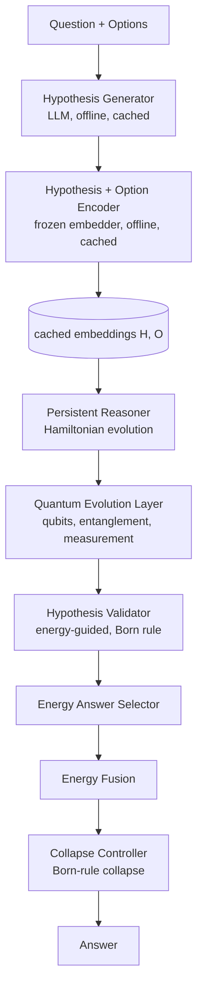
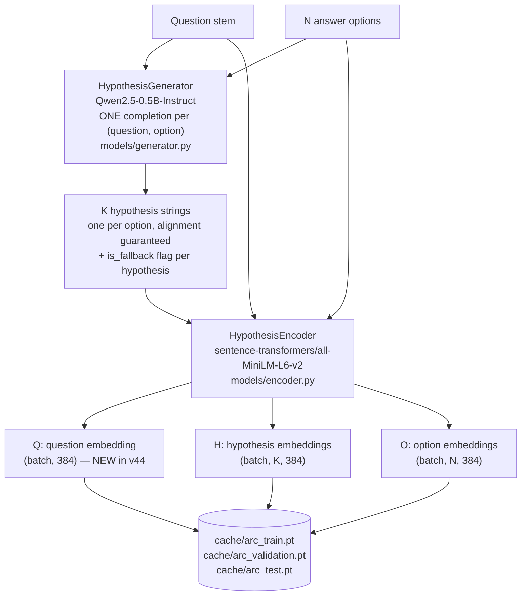
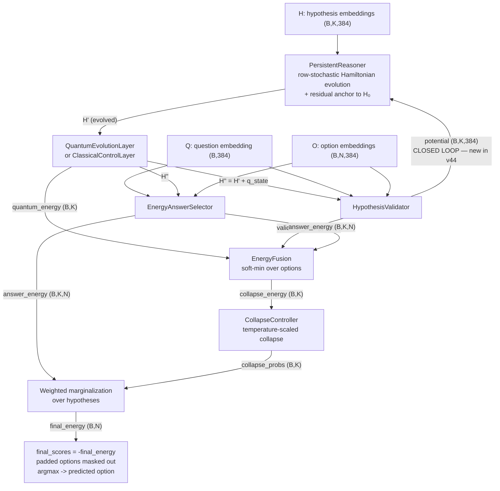
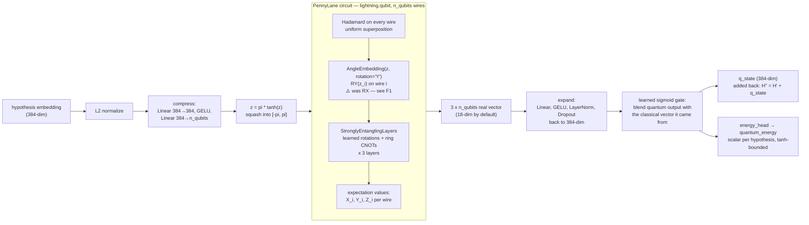
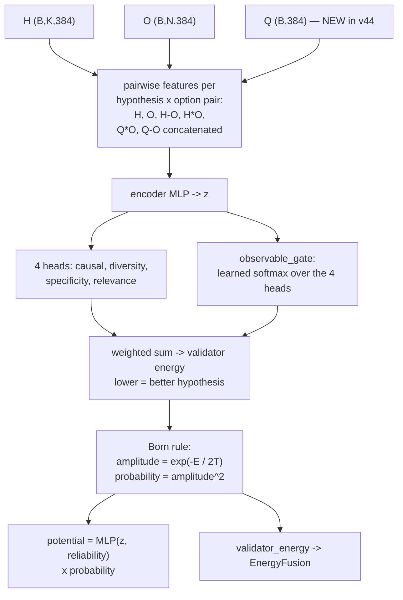
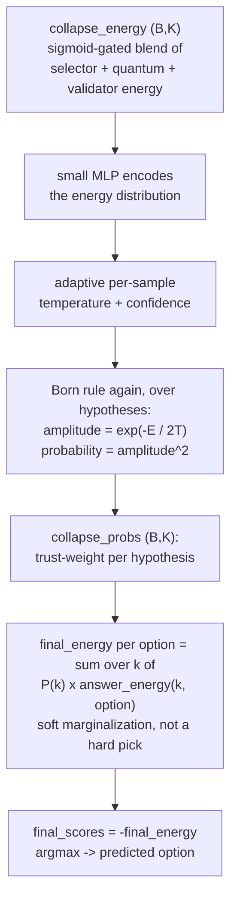
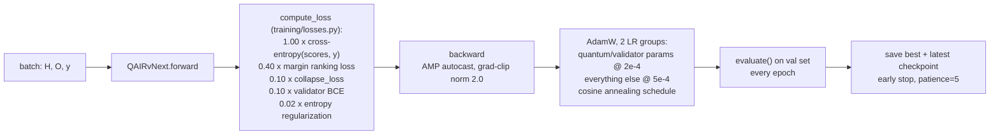

# <div align="center">⚛️ qAIR-vNext</div>

<div align="center">

### Persistent Multi-Hypothesis Quantum-Inspired Reasoning System for Large Language Models


</div>

---

# 🌌 Overview

qAIR-vNext is a research framework that replaces single-path LLM reasoning with:

- an LLM that generates one hypothesis per answer option,
- a differentiable quantum-circuit layer that evolves those hypotheses,
- an energy-guided validator that scores them,
- and a Born-rule-style collapse that turns the surviving hypotheses into an answer.

Instead of reasoning through a single sequential trajectory, qAIR-vNext keeps all hypotheses "in play" simultaneously and only combines them at the very end, weighted by how much the model trusts each one.

This README documents what the code actually does, end to end.

> **⚠️ v44 is a post-audit release. Start with [the audit section](#-v44-audit--what-was-broken-and-what-changed) — every quantum and ablation number produced before it is void.**

---

# 🔍 v44 Audit — What Was Broken, and What Changed

> **Read this before interpreting any result in this repository.**
> A full technical audit found that the three mechanisms constituting the research contribution — the quantum circuit, multi-hypothesis superposition, and Born-rule collapse — were **all provably inert** in the trained model. Every quantum and ablation result produced before v44 is void. The fixes are described below; the numbers that motivated them are measured, not estimated.

## The four fatal findings

### F1 — The quantum circuit ignored its input entirely

`Hadamard` on every wire prepares \|+⟩<sup>⊗n</sup>, the **+1 eigenstate of Pauli-X**. `AngleEmbedding` defaults to `rotation="X"`, and RX(θ)\|+⟩ = e<sup>−iθ/2</sup>\|+⟩ — a **global phase**, unobservable by any expectation value. The circuit's output was bit-exactly independent of the data:

```
output std across 8 distinct inputs :  0.000e+00      <- dead
same circuit without the Hadamard   :  0.094
```

The 1.12M-parameter "quantum layer" was a learned **constant**. `use_quantum=True` vs `False` measured nothing.

**Fix:** `rotation="Y"` — RY(θ)\|+⟩ tilts the Bloch vector off the equator, so the encoding is observable while the "start in uniform superposition" motif is preserved. Measured input-sensitivity: **0.123** (vs 0.094 for dropping the Hadamard, 0.089 for RZ).

### F2 — The persistent reasoner collapsed to a constant fixed point

After 5 steps, every hypothesis became the *same vector*, and that vector was independent of the input:

```
pairwise cos(H_k, H_j):  0.199 -> 0.814 -> 0.997 -> 0.9999 -> 1.000000
|| reasoner(H) - reasoner(0) ||  =  1.9e-03
```

Cause: `field_k = Σ_j a_kj H_j` with **unnormalized** `tanh` weights, so `field_k ≈ (Σ_j a_kj)·mean_j(H_j)` — the same vector for every k — injected with a large step, five times. Textbook oversmoothing. Two contributing bugs: `dt` and `memory_decay` were stored **post-sigmoid by mistake**, so `nn.Parameter(0.10)` gave an actual step size of `sigmoid(0.10) = 0.525`, 5× the intended value.

**Fix:** row-stochastic (softmax) interaction, a gated residual anchor to the original hypotheses each step, and logit-space `dt`/`decay`. Verified: no collapse even at 20 steps (pairwise cos 0.358), `dt` init now exactly 0.1000.

### F3 — The model's answer was bit-identical under every corruption of H

```
intact H, O                     294/869 = 0.3383
H := zeros                      294/869 = 0.3383
H := gaussian noise             294/869 = 0.3383
H shuffled within sample        294/869 = 0.3383
H from a DIFFERENT question     294/869 = 0.3383
H := O  (pure option echo)      294/869 = 0.3383
O := zeros                      223/869 = 0.2566   <- only O ever mattered
```

The reported 33.7% was an **option-prior classifier** — and it was *beaten by a 30-line MLP on option embeddings alone (35.9%)*. The architecture was net-negative against its own simplest baseline.

**Fix:** this is now a first-class regression test — `evaluation/input_ablation.py`, which exits non-zero if destroying the hypotheses doesn't cost accuracy. Run it after every training run.

### F4 — A third of all hypotheses were template noise, and alignment was broken

| | train | validation |
|---|---|---|
| fallback hypotheses | 4465/13478 = **33.1%** | 1168/3475 = **33.6%** |
| samples with ≥1 fallback | 62.1% | 62.8% |
| **100%** fallback samples | 315 (9.3%) | 83 (9.5%) |

Three compounding causes: `max_new_tokens=96` couldn't hold the requested output; the parser rejected any line containing `"question"`, `"answer"`, `"generate"` or `"hypothesis"` (words that saturate science explanations); and the fallback template `f"{option} correctly explains the …"` **embedded the option text verbatim**, making noise maximally similar to its own option — exactly the signal the selector keys on.

Worse than the rate was the **alignment**. Splitting one free-form completion on newlines never guaranteed line *k* described option *k*:

```
[0] OPT 'The refrigerator door is smooth.'
    HYP '**The refrigerator door is smooth**'         <- echo of opt 0
[1] OPT 'The refrigerator door contains iron.'  (CORRECT)
    HYP 'Smooth surfaces tend to attract magnetic...' <- reasoning about opt 0
[2] OPT 'The refrigerator door is a good conductor.'
    HYP '**The refrigerator door contains iron**'     <- echo of opt 1
```

Zero-shot `argmax diag(H·O)` scored **0.2670** — chance.

**Fix:** structural, not a better parser. One hypothesis per `(question, option)` pair, each in its **own completion**, so alignment is positional and cannot drift. Fallbacks are flagged (`is_fallback`) rather than silently mixed in, and no longer contain the option text.

## F5 — The question was never encoded (largest single win)

The question **text** was cached from day one. Its **embedding** never was, so the model judged options using only hypotheses that were a third garbage. Measured with a plain MLP on these exact cached embeddings:

| Information available | val acc |
|---|---|
| O only (≈ the old effective budget) | 0.3585 |
| **Q × O pairwise (+question, no hypotheses)** | **0.4849** |
| Q × O + H (+question, +old hypotheses) | 0.4408 |

**+12.6 points from encoding the question** — and note the third row: adding the *old* H made it **4.4 points worse**. H was not merely useless, it was actively harmful.

**Fix:** `Q` is now a first-class cache field threaded through the validator and selector. Existing caches are **migrated automatically on load** (encoder only, no LLM — takes a minute, not hours).

## Everything else that changed

| Area | Before | After |
|---|---|---|
| **Padding masks** | `H_mask`/`O_mask` computed in `collate_fn`, then **never passed to the model** — zero-padded options participated in every reduction and could be returned as the prediction | threaded end-to-end; verified that poisoning a padded slot changes real scores by `0.000e+00` |
| **`collapse_loss`** | **added** `diversity` (variance across hypotheses) and `spread` with positive weights — both globally minimized at *total collapse*. Training drove them to `8.2e-09` and `1.4e-08` | sign **reversed** and saturating (`−tanh(diversity)`); rewards distinguishable hypotheses |
| **Entropy target** | applied **twice** (collapse controller + `losses.py`), pinning entropy at 0.5 nats regardless of whether confidence was warranted — anti-calibration | removed; cross-entropy calibrates |
| **Born rule** | `collapse.py` = `softmax(−E/T)`, `validator.py` L1-normalized → `softmax(−2E/T)` — **inconsistent**, and the L1 form isn't the Born rule | unified on the L2 convention; **honestly documented as softmax-equivalent** (see below) |
| **Validator feedback** | `potential` computed, weighted, returned — and **never fed back**; `forward` called `self.reasoner(H)` with no potential | closed-loop: reasoner runs again guided by the potential |
| **Hypothesis reduction** | hard `torch.min` over options — gradient to the argmin only | temperature-controlled soft-min (`−τ·logsumexp(−E/τ)`) |
| **Energy fusion** | quantum term a convex blend, validator term an **unbounded addition** | both convex |
| **Confidence scaling** | `energy / confidence.clamp(min=0.2)` — up to 5× blow-up, then clamped to ±6; saturating that clamp killed gradients (the cause of the reverted warm-start experiment) | bounded modulation in [0.5, 1.5]; clamp widened to a safety net |
| **Seeding** | `set_seed` defined and **never called from any entry point** — no run was reproducible | called from every entry point; DataLoader generator seeded |
| **Test split** | ARC ships one; validation did double duty as selection *and* reported metric | held-out test split, reported once from the best checkpoint |
| **Ablation stats** | one run per config, single number | mean ± std over `config.SEEDS`, bootstrap CIs, paired McNemar (`evaluation/stats.py`) |
| **Ablation history** | all configs overwrote one shared `ckpt/history.pt` | per-run `{name}_history.pt` |
| **Trajectory capture** | `H.detach().cpu()` every step of every forward pass, including training | opt-in via `keep_trajectory` |

## ⚠️ On the "Born rule"

With **real, non-negative** amplitudes, `amplitude = exp(−E/2T)` → L2-normalize → square is **algebraically identical to `softmax(−E/T)`**. Verified numerically to fp32 epsilon (`5.96e-08`).

It carries **no expressive content beyond a temperature-scaled softmax.** The code is written in amplitude form because that is the object the project reasons about, and because it is the natural hook for the complex-amplitude extension — where cross-terms `2·Re(aᵢ·conj(aⱼ))` would make it genuinely non-classical. **Until that lands, "Born rule" here is notation, not physics**, and any write-up must say so.

## Verified after the fixes

Unit-level checks (`smoke` suite), all passing:

| Check | Before | After |
|---|---|---|
| Circuit output std across distinct inputs | `0.000e+00` | `2.6e-01` |
| Reasoner pairwise cos @ 20 steps, random init | collapsed by step 3 | `0.358` |
| `dt` initialization | `0.525` (intended 0.10) | `0.1000` |
| `memory_decay` initialization | `0.690` (intended 0.80) | `0.8000` |
| Poisoning a padded slot → change in real scores | affected the argmax | `0.000e+00` |
| Forward/backward, all 3 backends × validator on/off | — | finite loss, gradients flow |

End-to-end on the **migrated (question-added) but not regenerated** cache. Controlled: identical architecture, seed, and epoch budget — only `use_question` differs.

| run | val acc | `pairwise_cos` | `h_cos` |
|---|---|---|---|
| pre-fix v43 (quantum, 5 steps, 30 epochs) | 0.3372 | **1.000000** | — |
| v44, `use_question=False`, 12 epochs | 0.3372 | **0.5925** | 0.6341 |
| v44, `use_question=True`, 12 epochs | **0.3774** | 0.9773 | 0.9680 |

Three things this shows, and one of them is uncomfortable:

1. **The anti-collapse fix works.** `pairwise_cos` 1.000000 → **0.5925** in the no-question arm. The reasoner no longer contracts to a constant fixed point. This is the F2 fix confirmed in real training, not just at initialization.
2. **The question is worth +4.0 points** in the full model (0.3372 → 0.3774), still climbing monotonically at epoch 12 (0.374 → 0.375 → 0.376 → 0.377 — it had not converged).
3. **Adding the question makes the model collapse the hypothesis pathway *harder*** (0.59 → 0.98). That is not a regression — it is the model behaving correctly. Given a genuinely informative `Q` and a hypothesis set that is 33% template noise, routing around `H` is the rational optimization. It is the sharpest available confirmation that **the bottleneck is now the hypothesis data, not the architecture.**

Note also that the no-question arm lands on exactly 0.3372 — the same number the pre-fix model reported. That was the option-prior ceiling all along.

## What is still broken

**The multi-hypothesis mechanism is still largely inert, and the fixes to the model are not what will repair it.**

`pairwise_cos = 0.977` with `h_cos = 0.968` is the diagnostic signature of *hypotheses that stay distinct while the selector ignores them* — which is precisely what a cache full of template fallbacks and misaligned hypotheses should produce. This is consistent with the probe measurement that adding the **old** `H` to `Q × O` made accuracy **worse** (0.4849 → 0.4408).

So the honest reading: the architectural fixes were **necessary but not sufficient**, exactly as the audit predicted. The remaining gap is data, not architecture.

- ⚠️ **The shipped cache still contains the old 33%-fallback hypotheses.** Migration adds `Q` only — hypothesis quality cannot be repaired without regeneration. **Delete `cache/arc_*.pt` and rebuild** to get the F4 fix. This is now the highest-value action available.
- ⚠️ **`persistent_steps`, epochs, and LRs have not been re-tuned** since the fixes. The 12-epoch run had not converged; the old 30-epoch schedule was tuned against a collapsed model.
- ❌ **The decisive baseline has not been run.** `evaluation/baselines.py --mode direct` scores each option's likelihood under Qwen2.5-0.5B directly. If the full pipeline can't beat the model it's built on, the architecture is a lossy compression of knowledge the generator already had. **Run this before claiming anything.**

---

# 🧠 Core Idea

Traditional LLM reasoning:

```text
Input → Transformer → Softmax → Single Answer
```

qAIR-vNext reasoning:


```mermaid
flowchart TD
    Q["Question + Options"] --> GEN["Hypothesis Generator<br/>LLM, offline, cached"]
    GEN --> ENC["Hypothesis + Option Encoder<br/>frozen embedder, offline, cached"]
    ENC --> CACHE[("cached embeddings H, O")]
    CACHE --> PR["Persistent Reasoner<br/>Hamiltonian evolution"]
    PR --> QL["Quantum Evolution Layer<br/>qubits, entanglement, measurement"]
    QL --> VAL["Hypothesis Validator<br/>energy-guided, Born rule"]
    VAL --> SEL["Energy Answer Selector"]
    SEL --> FUS["Energy Fusion"]
    FUS --> COL["Collapse Controller<br/>Born-rule collapse"]
    COL --> ANS["Answer"]
```

---

# ✨ Key Features

<table>
<tr>
<td width="50%">

## ⚡ Persistent Reasoning

Hypotheses are refined over multiple internal steps (`persistent_steps`) via a learned Hamiltonian-style field before anything else touches them.

</td>
<td width="50%">

## 🌀 Quantum-Inspired Evolution

Each hypothesis is compressed into rotation angles, run through a parameterized quantum circuit (superposition + entanglement), and measured back into a classical vector.

</td>
</tr>

<tr>
<td width="50%">

## 🔥 Energy-Based Reasoning

Every stage (selector, quantum layer, validator) emits an *energy* rather than a probability; lower energy = better. These are fused before the final collapse.

</td>
<td width="50%">

## 🧩 Hypothesis Validation

A learned validator scores each hypothesis on causal quality, diversity, specificity, and relevance, and turns those scores into a Born-rule probability distribution.

</td>
</tr>

<tr>
<td width="50%">

## 📊 Visualization Engine

Manual plotting utilities for energy landscapes, attention/interaction maps, collapse spread, and PCA'd reasoning trajectories.

</td>
<td width="50%">

## 🧪 Ablation Framework

A deconfounded grid (`training/ablations.py`) that toggles quantum / validator / persistent-steps one variable at a time.

</td>
</tr>
</table>

---

# 🏗️ System Architecture

## 1. Offline stage — turning a question into embeddings

Generation and encoding happen once per dataset split and are cached to disk (`cache/arc_*.pt`); they are **not** part of the trainable model.

Since v44 the generator emits **one hypothesis per `(question, option)` pair, each in its own completion**. This is the F4 fix: splitting a single free-form completion on newlines never guaranteed that line *k* described option *k*, and the misalignment was silent. Batching now flattens every `(question, option)` pair into one padded `model.generate()` call, so throughput is preserved while alignment becomes positional and unbreakable.


```mermaid
flowchart TD
    Q["Question stem"] --> GEN["HypothesisGenerator<br/>Qwen2.5-0.5B-Instruct<br/>ONE completion per (question, option)<br/>models/generator.py"]
    OPT["N answer options"] --> GEN
    GEN --> HT["K hypothesis strings<br/>one per option, alignment guaranteed<br/>+ is_fallback flag per hypothesis"]
    HT --> ENC["HypothesisEncoder<br/>sentence-transformers/all-MiniLM-L6-v2<br/>models/encoder.py"]
    OPT --> ENC
    Q --> ENC
    ENC --> QE["Q: question embedding<br/>(batch, 384) — NEW in v44"]
    ENC --> H["H: hypothesis embeddings<br/>(batch, K, 384)"]
    ENC --> O["O: option embeddings<br/>(batch, N, 384)"]
    QE --> CACHE[("cache/arc_train.pt<br/>cache/arc_validation.pt<br/>cache/arc_test.pt")]
    H --> CACHE
    O --> CACHE
```

Two guards run at load time:

- **Dim guard.** A cache built under a different `EMBEDDING_DIM` raises rather than silently mixing incompatible embeddings.
- **Auto-migration.** A pre-v33 cache gains its `Q` embeddings in place on first load (encoder only, no LLM — about a minute). `report_quality()` then prints the fallback rate and warns if it exceeds 10%, because **migration cannot repair hypothesis quality** — that needs regeneration.

## 2. Online stage — `QAIRvNext.forward(H, O, Q, y, H_mask, O_mask)`

This is the trainable part. Every arrow below is a real tensor produced by the current code (`models/full_model.py`), not an aspirational design.


```mermaid
flowchart TD
    H["H: hypothesis embeddings (B,K,384)"] --> PR["PersistentReasoner<br/>row-stochastic Hamiltonian evolution<br/>+ residual anchor to H₀"]
    PR -->|"H' (evolved)"| QL["QuantumEvolutionLayer<br/>or ClassicalControlLayer"]
    QL -->|"quantum_energy (B,K)"| FUS
    QL -->|"H'' = H' + q_state"| VAL["HypothesisValidator"]
    QE["Q: question embedding (B,384)"] --> VAL
    QE --> SEL
    O["O: option embeddings (B,N,384)"] --> VAL
    VAL -->|"potential (B,K,384)<br/>CLOSED LOOP — new in v44"| PR
    VAL -->|"validator_energy (B,K)"| FUS["EnergyFusion<br/>soft-min over options"]
    QL -->|"H''"| SEL["EnergyAnswerSelector"]
    O --> SEL
    SEL -->|"answer_energy (B,K,N)"| FUS
    SEL -->|"answer_energy (B,K,N)"| MARG["Weighted marginalization<br/>over hypotheses"]
    FUS -->|"collapse_energy (B,K)"| COL["CollapseController<br/>temperature-scaled collapse"]
    COL -->|"collapse_probs (B,K)"| MARG
    MARG -->|"final_energy (B,N)"| SCORE["final_scores = -final_energy<br/>padded options masked out<br/>argmax -> predicted option"]
```

Note the final step is a **soft** marginalization: the model doesn't pick one hypothesis and discard the rest, it computes a weighted average of every hypothesis's opinion, weighted by `collapse_probs`. Superposition survives all the way to the answer.

> **The claim above is falsifiable in one command.** If `collapse_probs` is uniform, that weighted average degenerates to `mean_k E_kn` and the superposition is decorative. That is exactly what happened pre-v44. Run `python -m evaluation.input_ablation --ckpt ckpt/<name>_best.pt` — it exits non-zero if corrupting the hypotheses doesn't cost accuracy.

---

# 🔬 How Hypotheses Become Qubits

This is the part of `models/quantum_layer.py` that actually touches PennyLane. `n_qubits` defaults to 6 (down from 12 in earlier versions -- see the note below); the circuit runs on the `lightning.qubit` simulator (exact statevector, no shot noise).


```mermaid
flowchart LR
    H["hypothesis embedding<br/>(384-dim)"] --> N["L2 normalize"]
    N --> C["compress:<br/>Linear 384→384, GELU,<br/>Linear 384→n_qubits"]
    C --> S["z = pi * tanh(z)<br/>squash into [-pi, pi]"]
    S --> CIRC

    subgraph CIRC["PennyLane circuit — lightning.qubit, n_qubits wires"]
        direction TB
        HAD["Hadamard on every wire<br/>uniform superposition"] --> EMB["AngleEmbedding(z, rotation='Y')<br/>RY(z_i) on wire i<br/>⚠️ was RX — see F1"]
        EMB --> ENT["StronglyEntanglingLayers<br/>learned rotations + ring CNOTs<br/>x 3 layers"]
        ENT --> MEAS["expectation values:<br/>X_i, Y_i, Z_i per wire"]
    end

    CIRC --> V["3 x n_qubits real vector<br/>(18-dim by default)"]
    V --> EX["expand:<br/>Linear, GELU, LayerNorm, Dropout<br/>back to 384-dim"]
    EX --> GATE["learned sigmoid gate:<br/>blend quantum output with<br/>the classical vector it came from"]
    GATE --> QSTATE["q_state (384-dim)<br/>added back: H'' = H' + q_state"]
    GATE --> EHEAD["energy_head → quantum_energy<br/>scalar per hypothesis, tanh-bounded"]
```

**What's genuinely "quantum" here:** the Hadamards put every wire into superposition before any data is loaded; `AngleEmbedding` encodes each hypothesis's learned features as qubit rotation angles; `StronglyEntanglingLayers` couples the qubits together (a classical MLP can't do this — entanglement means the joint state isn't separable into independent per-qubit factors); the Pauli expectation values are the quantum-mechanical observables of that entangled state. **What it is not:** this runs on a classical statevector simulator with autograd through it, so it's exact and noiseless — there's no sampling, no hardware, and no claimed computational advantage (see [Research Disclaimer](#️-research-disclaimer)). The circuit's outputs are just another differentiable feature transform from the training's point of view; the "quantum-ness" is in *how* that transform is structured, not in the training loop treating it specially.

**Why 6 qubits, not 12:** the statevector this circuit simulates has `2^n_qubits` entries, and every gate acts on the whole vector -- cost scales roughly `O(n_qubits · 2^n_qubits)` per circuit evaluation, and this runs once per hypothesis, per sample, per batch, per epoch. At `n_qubits=12` this was the dominant per-epoch cost by a wide margin. Dropping to 6 qubits cuts the simulated state from 4096-dim to 64-dim -- a large constant-factor speedup with a much smaller circuit -- while still producing an 18-dim measurement vector, comparable to what similar hybrid quantum-classical "feature map" layers use in the literature.

---

# 🧩 How Validation Works

`models/validator.py`'s job is to score each hypothesis against every answer option and turn those scores into a probability distribution — using the same Born-rule construction (`amplitude = exp(-E/2T)`, `probability = amplitude²`) that the final collapse uses later.


```mermaid
flowchart TD
    H["H (B,K,384)"] --> FEAT["pairwise features per<br/>hypothesis x option pair:<br/>H, O, H-O, H*O,<br/>Q*O, Q-O concatenated"]
    O["O (B,N,384)"] --> FEAT
    QQ["Q (B,384) — NEW in v44"] --> FEAT
    FEAT --> ENC2["encoder MLP -> z"]
    ENC2 --> HEADS["4 heads: causal, diversity,<br/>specificity, relevance"]
    ENC2 --> GATE2["observable_gate:<br/>learned softmax over the 4 heads"]
    HEADS --> WSUM["weighted sum -> validator energy<br/>lower = better hypothesis"]
    GATE2 --> WSUM
    WSUM --> BORN["Born rule:<br/>amplitude = exp(-E / 2T)<br/>probability = amplitude^2"]
    BORN --> POT["potential = MLP(z, reliability)<br/>x probability"]
    BORN --> VE["validator_energy -> EnergyFusion"]
```

The four heads (`causal`, `diversity`, `specificity`, `relevance`) are explicitly named after physical observables in the code (`observable_gate`) — the model learns how much to weight each one per sample, rather than using fixed weights. When ground-truth labels (`y`) are available, `relevance` also gets a direct BCE supervision signal against the true option index (`training/losses.py`).

`potential` **is now consumed.** Before v44 it was computed, probability-weighted, returned — and silently dropped, because `QAIRvNext.forward` called `self.reasoner(H)` without it even though `PersistentReasoner.forward(H, potential=None)` had always accepted one. The validator only reached the answer through `validator_energy` in `EnergyFusion`, never through the reasoning trajectory. With `validator_feedback=True` (the default) the reasoner runs a second pass guided by the potential, closing the loop the architecture was always described as having.

---

# 🌀 Collapse & Answer Selection

`models/collapse.py` runs the same Born-rule pattern a second time, this time over the *fused* per-hypothesis energy (selector + quantum + validator, blended by `models/energy_fusion.py`'s learned sigmoid gates) rather than over hypothesis-vs-option scores.


```mermaid
flowchart TD
    CE["collapse_energy (B,K)<br/>sigmoid-gated blend of<br/>selector + quantum + validator energy"] --> ENC3["small MLP encodes<br/>the energy distribution"]
    ENC3 --> TC["adaptive per-sample<br/>temperature + confidence"]
    TC --> BORN2["Born rule again, over hypotheses:<br/>amplitude = exp(-E / 2T)<br/>probability = amplitude^2"]
    BORN2 --> PROBS["collapse_probs (B,K):<br/>trust-weight per hypothesis"]
    PROBS --> MARG2["final_energy per option = sum over k of<br/>P(k) x answer_energy(k, option)<br/>soft marginalization, not a hard pick"]
    MARG2 --> ANSWER["final_scores = -final_energy<br/>argmax -> predicted option"]
```

"Delayed collapse" in this codebase means: the probability distribution over hypotheses is computed with a *learned, per-sample temperature* (not a fixed annealing schedule), and it's used to *weight* the final answer rather than to hard-select a single hypothesis. `collapse.py` also emits `entropy`, `diversity`, `spread`, and `peak` metrics that feed directly into the training loss below, nudging the collapse distribution toward a target entropy of 0.5 (neither a single dominant hypothesis nor a uniform blur).

---

# 🏋️ Training


```mermaid
flowchart LR
    B["batch: H, O, y"] --> F["QAIRvNext.forward"]
    F --> L["compute_loss (training/losses.py):<br/>1.00 x cross-entropy(scores, y)<br/>0.40 x margin ranking loss<br/>0.10 x collapse_loss<br/>0.10 x validator BCE<br/>0.02 x entropy regularization"]
    L --> BK["backward<br/>AMP autocast, grad-clip norm 2.0"]
    BK --> OPT["AdamW, 2 LR groups:<br/>quantum/validator params @ 2e-4<br/>everything else @ 5e-4<br/>cosine annealing schedule"]
    OPT --> EV["evaluate() on val set<br/>every epoch"]
    EV --> CK["save best + latest checkpoint<br/>early stop, patience=5"]
```

- The quantum layer is force-run outside autocast in fp32 (`with autocast(enabled=False)`) — `lightning.qubit`/PennyLane's autograd through the circuit isn't mixed-precision safe, so only that submodule pays the fp32 cost.
- Quantum and validator parameters get a lower learning rate (2e-4) than the rest of the model (5e-4) since they're the newest, least-converged components.
- All of this is centralized in [`config.py`](config.py) — dim, `n_qubits`, `persistent_steps`, LRs, batch size, epochs, patience, and checkpoint/cache directories are defined once and imported everywhere, rather than hardcoded per entry point.
- **Current defaults (v44):** `batch_size=16`, `epochs=30`, `patience=5`, `n_qubits=6`, `persistent_steps=3` (down from 5 — the old value was chosen when deeper meant more collapse, and has **not been re-tuned** since the fix), `seed=42`, `SEEDS=(42..46)` for the ablation sweep.

---

# 📂 Project Structure

```text
qAIR-CSE499B/
│
├── benchmarks/          # dataset loaders (ARC-Challenge + ARC-Easy merged)
├── cache/                # cached hypothesis/option embeddings (built on first run)
├── ckpt/                 # model checkpoints, one set per ablation config
├── evaluation/            # manual inference & sample-question evaluation
├── exports/               # plots/CSVs/reports written by visualization/
├── logs/
├── models/                 # QAIRvNext and its submodules
│   ├── generator.py          # HypothesisGenerator (LLM, offline)
│   ├── encoder.py             # HypothesisEncoder (frozen embedder, offline)
│   ├── persistent_reasoner.py # Hamiltonian-style iterative reasoning
│   ├── quantum_layer.py       # QuantumEvolutionLayer (PennyLane circuit)
│   ├── classical_control_layer.py # parameter-matched classical control
│   ├── validator.py           # HypothesisValidator (energy + Born rule)
│   ├── answer_selector.py     # EnergyAnswerSelector
│   ├── energy_fusion.py       # blends selector/quantum/validator energy
│   ├── collapse.py            # CollapseController (Born-rule collapse)
│   └── full_model.py          # QAIRvNext -- wires the above together
├── evaluation/
│   ├── input_ablation.py      # ⭐ does the model actually use its hypotheses?
│   ├── baselines.py           # data ceiling probes + direct-LLM baseline
│   ├── stats.py               # bootstrap CIs + paired McNemar
│   └── sample_inference.py    # manual qualitative inspection
├── notebooks/
│   ├── qAIR_v44.ipynb         # ⭐ current cell-by-cell workflow
│   ├── qAIR_v43.ipynb         # pre-audit, will NOT run on the current API
│   ├── qair_v42_colab.ipynb   # pre-audit, history
│   ├── qair_v40_colab.ipynb   # pre-audit, history
│   └── diagnose_quantum_speed.py
├── training/                  # dataset, losses, trainer, ablation grid
├── visualization/              # manual plotting utilities (not auto-wired)
├── config.py                    # single source of truth for shared hyperparameters
├── main.py                      # CLI entry point: --mode train | ablation
└── requirements.txt
```

---

# 🧬 Benchmarks

| Benchmark               | Status         | Purpose                    |
| ------------------------ | -------------- | --------------------------- |
| ARC-Challenge + ARC-Easy | ✅ Implemented | Grade-school science reasoning (merged for more training data — see `benchmarks/arc.py`) |
| GSM8K                    | 🔲 Planned     | Multi-step math reasoning  |
| CommonsenseQA             | 🔲 Planned     | Commonsense reasoning      |
| StrategyQA                 | 🔲 Planned     | Implicit reasoning         |
| TruthfulQA                  | 🔲 Planned     | Hallucination resistance   |

---

# 🧪 Ablation Framework

The grid in `training/ablations.py` is deconfounded — each row changes exactly one variable relative to its nearest neighbor, so effects can be isolated instead of tangled together.

| Config | Question | Bottleneck | Validator | Steps | Isolates |
| --- | :---: | :---: | :---: | :---: | --- |
| `A0_no_question` | ✗ | ✗ | ✗ | 3 | **the question embedding**, vs. `A1_baseline` |
| `A1_baseline` | ✓ | ✗ | ✗ | 3 | floor — neither module |
| `A1b_quantum_only` | ✓ | quantum | ✗ | 3 | quantum, vs. `A1_baseline` |
| `A1c_classical_control_only` | ✓ | classical | ✗ | 3 | **circuit vs. parameter-matched MLP**, vs. `A1b` |
| `A2_validator` | ✓ | ✗ | ✓ | 3 | validator, vs. `A1_baseline` |
| `A3_persistent` | ✓ | quantum | ✓ | 3 | quantum + validator together |
| `A3c_classical_control_persistent` | ✓ | classical | ✓ | 3 | circuit vs. MLP, with validator on |
| `A4_full_hybrid` | ✓ | quantum | ✓ | 5 | `persistent_steps` 3→5, vs. `A3` |

`A1b` vs `A1c` is the most important row and the one a reviewer will look at first. `ClassicalControlLayer` reproduces `QuantumEvolutionLayer`'s entire surrounding architecture — same compress/expand widths, same fusion gate, same correction and energy heads, same input squashing — and swaps *only* the PennyLane circuit for a classical MLP at the circuit's measurement width. Total layer parameters match to within a fraction of a percent (the circuit is 54 of ~1.12M), so a gap between these two arms cannot be explained by capacity. It is the circuit or it is nothing.

> ⚠️ **Every pre-v44 quantum ablation number is void.** Because of F1 the circuit emitted a learned constant, so `A1b` vs `A1` measured the effect of adding a constant bias — and `A1c` would have compared a working MLP against that constant, producing a confident and completely wrong conclusion. Do not compare new numbers against old ones.

Every config trains from a fresh random init (warm-starting from a "parent" config's weights was tried and reverted — it saturated `EnergyAnswerSelector`'s clamp and killed gradient flow through the newly-added component). Each config is trained under every seed in `config.SEEDS` and reported as mean ± std; `evaluation/stats.py` adds bootstrap CIs and paired McNemar tests.

---

# 🚀 Installation

## Clone Repository

```bash
git clone https://github.com/Thorfast191/qAIR-CSE499B.git
cd qAIR-CSE499B
```

## Install Dependencies

```bash
pip install -r requirements.txt
```

---

# ☁️ Google Colab Setup

The current cell-by-cell workflow is [`notebooks/qAIR_v44.ipynb`](notebooks/qAIR_v44.ipynb) (local — dataset/cache build, model, trainer, training loop, the verification suite, then visualization, each in its own inspectable cell).

> ⚠️ `qAIR_v43.ipynb`, `qair_v42_colab.ipynb` and `qair_v40_colab.ipynb` are **pre-audit and will not run against the current API** — the model now requires `Q`, the ablation suite returns a different shape, and `trajectory` is opt-in. They are kept as history. Use v44.

Use a **fresh** Drive folder per version — caches built under a different `EMBEDDING_DIM` or a different generator are not compatible, and the dim guard in `training/dataset.py` will refuse them:

```python
from google.colab import drive
import os

drive.mount('/content/drive')

BASE = "/content/drive/MyDrive/qAIR_V44"
for p in ["cache", "ckpt", "logs", "exports"]:
    os.makedirs(f"{BASE}/{p}", exist_ok=True)
```

---

# ▶️ Run Training

```bash
python main.py --mode train
```

# ▶️ Run Ablation Suite

```bash
python main.py --mode ablation
```

Both commands use the defaults in `config.py` (cache/checkpoint directories, batch size, epochs, patience, `n_qubits`, seeds) unless overridden by calling `run_training()` / `run_ablation_suite()` directly with different arguments.

`--mode ablation` now sweeps every config across every seed in `config.SEEDS` and reports mean ± std, because a single run's accuracy on ARC's 869-example validation split carries a standard error of ~1.6 points — larger than most of the gaps this grid produces.

---

# ✅ Verification Workflow

Run these in order. Steps 1 and 2 are cheap and decide whether the rest is worth doing.

```bash
# 0. Build the cache. ONE-TIME and slow (~10 h train, ~2.5 h validation on
#    CPU; 20-30x faster on GPU). Safe to interrupt -- it autosaves every 50
#    samples and saves are atomic, so rerunning the same command resumes
#    where it stopped rather than restarting.
python scripts/build_cache.py --splits train validation

# 1. Establish the ceiling and the baseline you must beat.
#    Probes are seconds; --mode direct needs the LLM.
python -m evaluation.baselines --mode all

# 2. Train.
python main.py --mode train --seed 42

# 3. THE test that matters. Exits non-zero if the model
#    ignores its hypotheses -- i.e. if the research claim is false.
python -m evaluation.input_ablation --ckpt ckpt/qair_v44_best.pt

# 4. Full grid across seeds, with a held-out test split.
python main.py --mode ablation

# 5. Bootstrap CIs + paired McNemar between arms.
python -m evaluation.stats --results ckpt/ablation_results.pt
```

**Interpreting step 3.** This is not a nice-to-have. The pre-v44 model scored a respectable-looking 33.7% while being bit-identically unaffected by having its hypotheses replaced with zeros. Accuracy alone could never have revealed that. If step 3 fails, no number from steps 2 or 4 supports any claim about superposition, collapse, or quantum reasoning — regardless of how good it looks.

Watch `pairwise_cos` in the training log for the same reason: it measures how distinguishable the hypotheses are after reasoning. Approaching 1.0 means they have merged into one vector and the collapse distribution is uniform by construction. The trainer prints a `[COLLAPSE WARNING]` above 0.99.

---

# 📊 Example Research Outputs

## Energy Landscape

```text
Step 0 → broad energy spread
Step 1 → interaction refinement
Step 2 → selective amplification
Step 3 → delayed collapse
```

---

# ⚠️ Known Limitations

Documented honestly so the architecture diagrams above aren't read as claims about behavior that doesn't exist yet:

**Fixed in v44** (was: validator guidance isn't closed-loop) — `potential` now feeds back into the reasoner. See the [audit section](#-v44-audit--what-was-broken-and-what-changed).

**Still open:**

- **"Born rule" is currently notation, not physics.** With real, non-negative amplitudes it is algebraically identical to `softmax(−E/T)` — verified to fp32 epsilon. It adds no expressive content over a temperature-scaled softmax. Making it real requires complex amplitudes so interference cross-terms contribute; until then, do not describe it as quantum in a write-up.
- **The shipped cache still has pre-v44 hypotheses.** Auto-migration adds question embeddings only. A third of the cached hypotheses are template fallbacks and their option alignment is unreliable. **Delete `cache/arc_*.pt` and rebuild** to get the F4 fix — this costs LLM time, which is why it isn't automatic.
- **The generator-direct baseline has not been measured.** Until `evaluation/baselines.py --mode direct` is run, it is unknown whether the pipeline beats simply asking Qwen2.5-0.5B the question. This is the first thing a reviewer will check.
- **`persistent_steps` has not been re-tuned since the collapse fix.** The old default of 5 was chosen when deeper meant more collapse; the current default is 3 and the right value is now an open empirical question.
- **The quantum layer is a simulator, not hardware.** `lightning.qubit` runs an exact statevector simulation with autograd through it — no shot noise, no physical qubits, no claimed quantum computational advantage. It's a differentiable circuit-structured feature transform.
- **The circuit is a very small function class.** 6 qubits × 3 layers = **54 trainable parameters**, against ~1.12M in the surrounding classical MLPs of the same layer. Even working correctly, its capacity to contribute is limited by construction — which is precisely what `ClassicalControlLayer` exists to measure.
- **`visualization/*.py` and `evaluation/sample_inference.py` are manual tools.** They aren't invoked automatically by `main.py` or the training loop; run them yourself from a notebook.
- **Only ARC is implemented.** The other benchmarks listed above are planned, not wired up.

---

# 🎯 Research Goals

qAIR-vNext explores:

- persistent reasoning systems,
- dynamic hypothesis evolution,
- energy-based reasoning control,
- multi-path reasoning architectures,
- and quantum-inspired latent dynamics.

---

# 🔬 Current Research Status

**Post-audit (v44). The central mechanism is repaired but not yet demonstrated to work.**

| | Status |
|---|---|
| Quantum circuit responds to its input | ✅ fixed (was bit-exactly constant) |
| Reasoner avoids representational collapse | ✅ fixed at the architecture level |
| Question conditioning | ✅ added (+12.6 pts on a probe) |
| Masking, seeding, held-out test, multi-seed stats | ✅ done |
| Validator → reasoner feedback loop | ✅ closed |
| Hypotheses actually influence the answer | ⚠️ **partial** — `pairwise_cos` 1.000 → 0.977 |
| Hypothesis cache regenerated | ❌ **not done** — still 33% template fallbacks |
| Beats the generator LLM answering directly | ❌ **unmeasured** — the decisive open question |
| "Born rule" is more than a softmax | ❌ needs complex amplitudes |

## Current Focus

1. Rebuild the hypothesis cache with the fixed per-option generator
2. Measure the direct-LLM baseline (`evaluation/baselines.py --mode direct`)
3. Re-tune `persistent_steps` and the epoch schedule against a non-collapsed model
4. Re-run the full ablation grid — **every pre-v44 quantum result is void**
5. Complex amplitudes, so interference is physical rather than notational

---

# 📚 Citation

```bibtex
@misc{qairvnext2026,
  title={qAIR-vNext: Persistent Multi-Hypothesis Quantum-Inspired Reasoning for Language Models},
  author={Md Arafat Islam},
  year={2026}
}
```

---

# 👨‍💻 Author

<div align="center">

## Md Arafat Islam

Quantum-Inspired AI Research

</div>

---

# ⚠️ Research Disclaimer

This repository is an active research framework.

The project explores:

- quantum-inspired reasoning dynamics,
- persistent hypothesis systems,
- and energy-based reasoning architectures.

This is NOT a claim of quantum computational advantage. The quantum circuit runs on a classical statevector simulator (`lightning.qubit`) with exact, noiseless expectation values -- it is a differentiable, physically-inspired feature transform, not a demonstration of any advantage physical quantum hardware would provide.

---

# 🌠 Future Directions

**Next, in priority order (from the v44 audit):**

1. **Rebuild the cache** with the fixed per-option generator — the shipped one is still 33% template noise.
2. **Run the direct-LLM baseline.** If the pipeline can't beat Qwen2.5-0.5B answering directly, that reframes the whole project.
3. **Complex amplitudes** in the collapse and validator, so interference cross-terms `2·Re(aᵢ·conj(aⱼ))` actually contribute. This is what would make "Born rule" a physical claim rather than a rename of softmax — and it is the most scientifically interesting open item here.
4. **Data re-uploading** in the circuit (interleave embedding and entangling layers) — 54 parameters is a very small function class even now that it works.
5. **Re-tune `persistent_steps`** now that depth no longer means collapse.

**Longer term:**

- Dynamic hypothesis spawning
- Reinforcement-guided collapse
- Long-horizon persistent memory
- Multi-agent reasoning fields
- Energy landscape optimization
- Graph-based reasoning interaction
- Differentiable collapse scheduling
- Expand benchmark coverage to GSM8K, CommonsenseQA, StrategyQA, TruthfulQA
- Shot-based / hardware quantum backend as an optional, explicitly-labeled experiment

---

<div align="center">

# ⚛️ qAIR-vNext

### Persistent Hypothesis-Field Reasoning for the Next Generation of AI

</div>